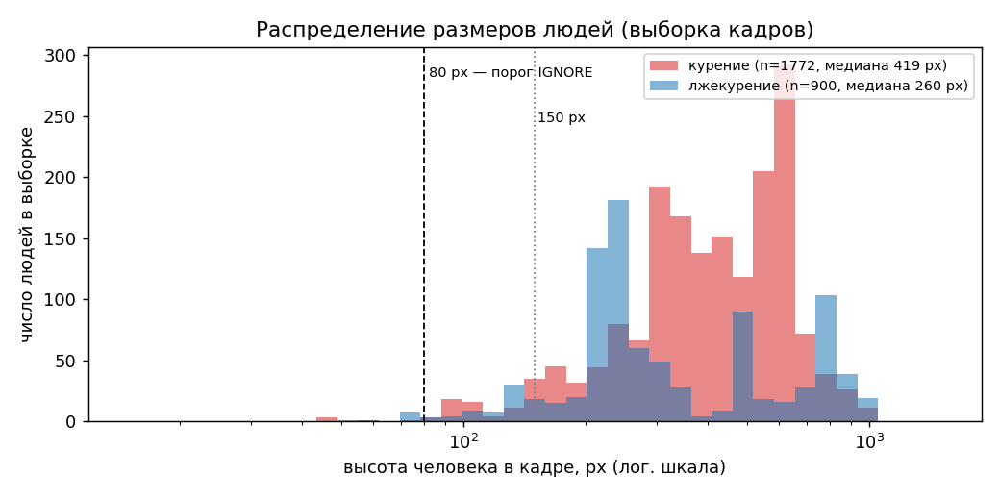
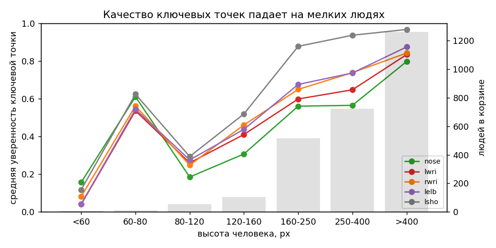
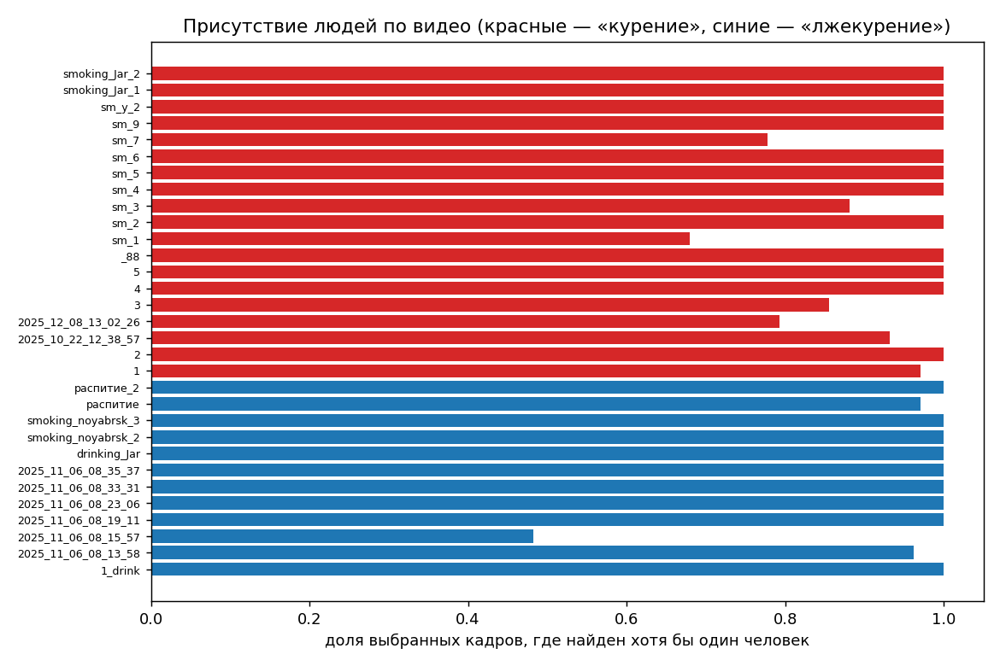
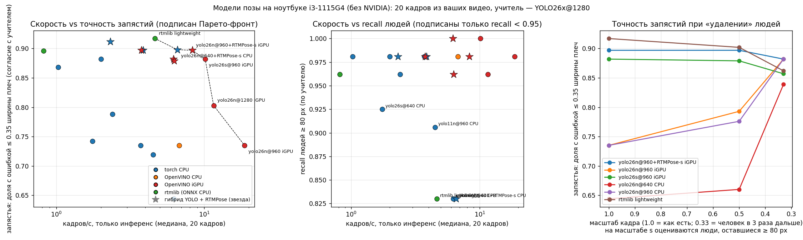
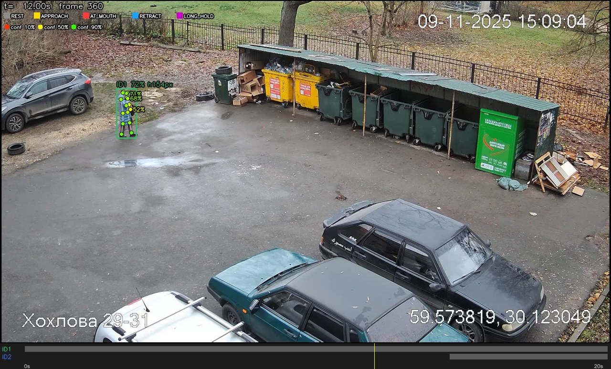
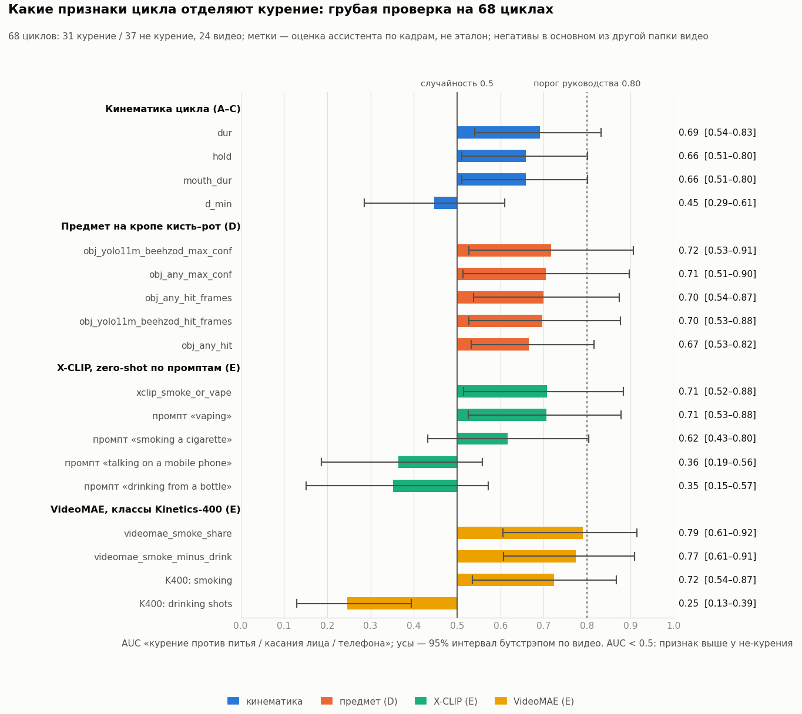
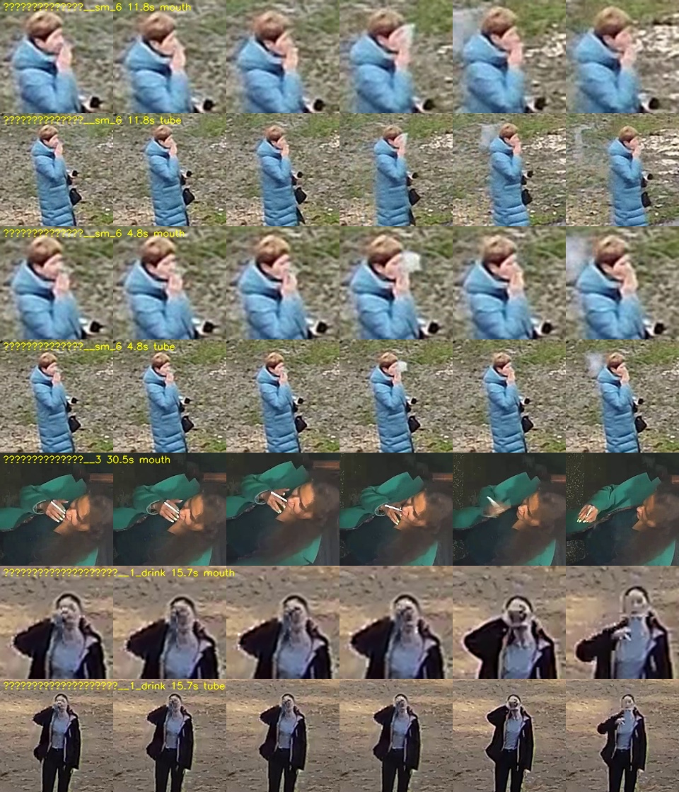
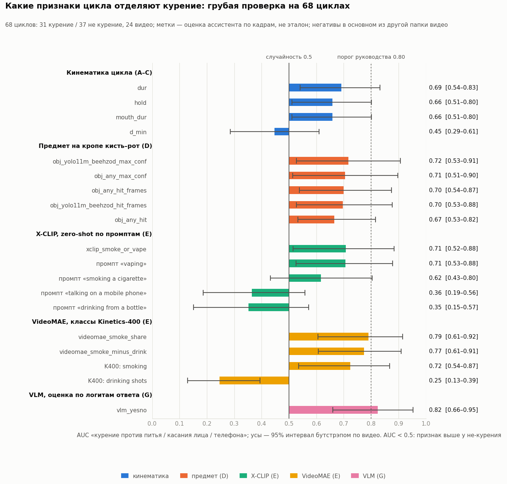
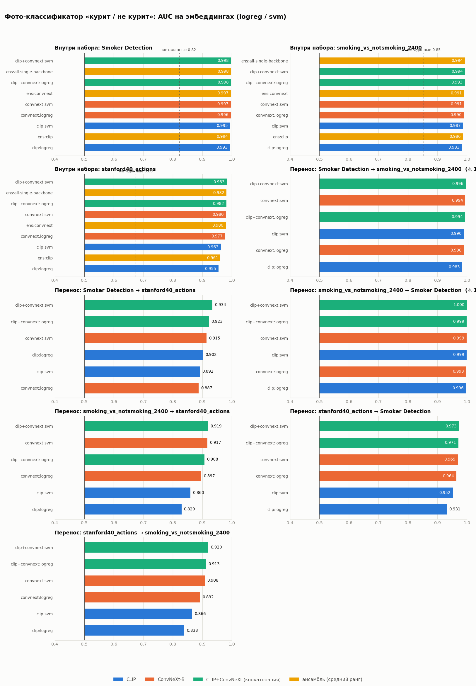
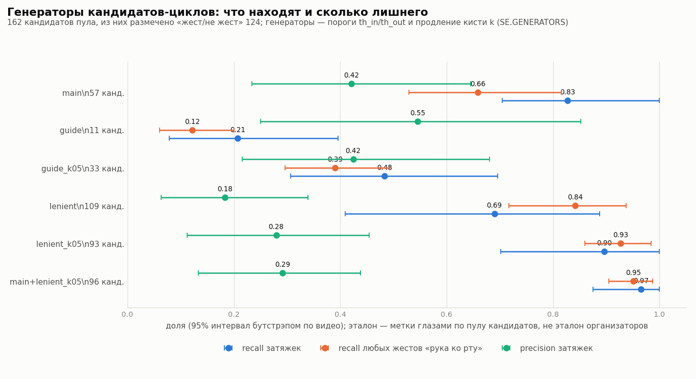

# Предварительный анализ: подходы, модели и качество частей пайплайна

> Дата: 7 октября 2026. Основной файл выводов этапа подготовки. Рядом: [CLI.md](CLI.md) (как всё проверять и запускать),
> [DATA_AND_WEIGHTS.md](DATA_AND_WEIGHTS.md) (что скачано / что можно скачать вручную), [TRAINING.md](TRAINING.md) (подготовка обучения классификатора).
> Все числа получены на вашем ноутбуке; команды для воспроизведения указаны в каждом разделе. **Честные оговорки** — в разделе 10.

## 0. Резюме

Главное, что показал этап (подробности и числа — в разделах ниже):
1. **Железо — CPU-only** (i3-1115G4, 7.7 ГБ ОЗУ, только Intel UHD). Спасает встроенная графика через OpenVINO: YOLO26n-pose@960 — **18.7 к/с против 3.7 на torch-CPU (×5)**; профиль по умолчанию YOLO26n + RTMPose-s даёт **≈ 9.5 к/с сквозной** и вдвое точнее по запястьям (раздел 7.1).
2. **Ваши видео — записи гатчинских камер**, но люди крупнее, чем ожидается на скрытом наборе (медиана 377 px против 80–200 px) — точность на скрытом наборе, скорее всего, ниже (раздел 5).
3. **Пороги руководства по сырому запястью слишком строги:** находят 2 из 12 затяжек; откалиброванные (`th_in 0.65 / th_out 0.90`) — 11 из 12 (раздел 7.3).
4. **Голый регламент не отличает курение от питья/касания лица/телефона:** только ~35% найденных циклов — затяжки, а в 8 из 12 негативных клипов правила дают ложное событие (раздел 7.4). Ядро решения — классификатор по вектору признаков: код, разметка, обучение и тесты готовы; нужны размеченные циклы.
5. **Предмет и видео-модели по отдельности слабы:** детектор сигареты на кропе кисть–рот находит предмет лишь у 48–55% затяжек и срабатывает на 44% циклов питья (AUC 0.72); VideoMAE даёт AUC 0.79, но часть сигнала — сцена; X-CLIP zero-shot («smoking a cigarette») — 0.62. Вместе с кинематикой на 68 грубо размеченных циклах ≈ 0.8 AUC (разделы 7.5–7.6) — это проверка «есть ли сигнал», не итоговое качество.
6. **VLM работает локально через Ollama** (установлен, сервер только на 127.0.0.1 и без облака). Лучший вариант — Qwen3.5-2B (q4_K_M) на крупных кропах рта и руки: **AUC 0.82** на 68 размеченных циклах, ≈ 9 с на цикл на встроенной графике, единственный сильный признак, не выдающий сцену, +0.05 AUC к остальным признакам (раздел 8). Модели поменьше (SmolVLM2-500M, Qwen3.5-0.8B) слабее или бесполезны; Qwen3-VL-2B не запускается из-за числа токенов на кадр.
7. **Проверка на текущих данных** (раздел 7.7): обучение на реальных векторах, сборка событий и протокол оценки работают от начала до конца; на эталоне из 7 событий классификатор даёт 1–2 ложных события в негативных клипах против 8 у правила длительности паузы. Это проверка механики, не качества.
8. **Не завершено:** итоговые метрики на настоящих размеченных данных и на открытых датасетах, проверка VLM на дальних сценах (80–200 px), из веб-интерфейса не нажимались рендер видео, предмет, VideoMAE, кнопки меток и обучения (раздел 10).
9. **Этап 3 (раздел 9; метки — мои, выборки малы):** фото-классификатор на открытых фото сильный (AUC 0.96–0.998 внутри наборов, 0.83–0.97 при переносе), но **на кропах рта из ваших видео почти случайный (0.54–0.65)** — в «дешёвый» пакет не включён; рабочий автомат находит 85% затяжек пула (старт ±0.5 с у 76%), объединение с мягким генератором — 97% ценой 1.6× кандидатов; ансамбль над кандидатами с положением точек — AUC 0.87 на пуле (130 кандидатов) и 0.73–0.79 на 68 основных циклах; при пороге 0.5 объединение даёт recall затяжек 0.74 вместо 0.62 при той же точности. Детекторы предмета зависят от размера входа (basant18 при 640 заметно лучше, чем при 416), на рамках CigDet Beehzod находит предмет на 93% снимков, но mAP50 0.46 против 0.70 у basant18; **«дым» как признак на кропах ваших камер не обнаружен** (простые признаки 0.48–0.64, CLIP «виден дым» 0.79–0.80 — но это сцена, а сам эффект появления дыма 0.56); на открытых клипах HMDB51 (крупные планы) конвейер не работает — рука подходит ко рту лишь в 13% клипов «курение», AUC 0.51: источник вне режима камер наблюдения. Построены полный цикл `sd recognize`, плеер, подключение и проверка новых моделей, Docker (сборка не проверена), безопасные пакеты моделей. **На ПК обнаружен криптомайнер** (раздел 10, пункт 7).

## 1. Задача и что на самом деле оценивается (из руководства)

Нужен не классификатор «курит / не курит», а **детектор событий во времени, привязанных к человеку**: эпизод одного `person_track_id` с началом, концом, confidence, `peak_sec` и рамкой человека в этот момент. Метрика — Event F1 на скрытом наборе (снят 9 октября 2026 в Гатчине: 12 позитивов, 12 негативов, 30 мин фона).

Правила, которые реализуются буквально: цикл жеста = рука к области рта → пауза у рта 0.5–5 с → отвод; POSITIVE = в окне 20 с два полных цикла либо один цикл + прямой признак (предмет/дым); склейка циклов **одного** человека при паузе ≤ 15 с, разных людей не склеиваем; человек < 80 px → IGNORE; совпадение по рамке (IoU ≥ 0.30 в `peak_sec`), допуск по времени ±3 с и пересечение ≥ 1 с.

Что это означает для решения (и как это отражено в каркасе):
1. Трекинг людей и корректная рамка обязательны (иначе FP + FN одновременно) → `pose_track.py`, `tracks.py` (склейка треков), метрики трекинга в разделе 7.2.
2. Точность границ вторична — главное не дробить эпизод и не склеивать людей → `events.py` (`build_events` бросает ошибку при циклах разных треков), тесты на фрагментацию.
3. Сложные негативы (телефон, питьё, еда, ручка у губ, касание носа, сигарета в руке без затяжки) отсекаются **логикой циклов + признаками**, а не «рукой у лица» → автомат с гистерезисом и классификатор.
4. Скрытый набор крошечный: одна ошибка ≈ 4–8 п.п. F1 → ценится стабильность и проверяемость, а не «умность» модели.
5. Порог фиксируется заранее и подгонка по контрольным меткам запрещена → `manifest.json`, групповая валидация.
6. Обработка локальная; облачные VLM-API недоступны → только локальные модели (раздел 8).

## 2. Железо и его следствия

Проверено командой `sd.cmd hw --bench` (полный отчёт — `outputs/analysis/hw.json`).

| параметр | значение |
|---|---|
| ноутбук | ASUS VivoBook X513EA, Windows 11 Pro |
| CPU | Intel Core i3-1115G4, **2 ядра / 4 потока**, до 3.0 ГГц, AVX-512 |
| ОЗУ | **7.7 ГБ** (одна планка DDR4-3200); свободно в разные моменты 0.2–0.7 ГБ из-за браузера, мессенджеров и самого Claude → активный своп (файл подкачки 12 ГБ) |
| GPU | только встроенная **Intel UHD (iGPU)**; **NVIDIA/CUDA нет** |
| диск | свободно ~31 ГБ из 230 |
| fp32 matmul 1024², 2 потока | **112 GFLOPS**; bf16 — 31 GFLOPS (на этом CPU bf16 медленнее fp32, использовать нельзя) |
| OpenVINO 2026.4 | видит устройства `CPU` и `GPU` (Intel UHD) → можно запускать на iGPU |
| ffmpeg | 7.1 (imageio-ffmpeg), есть `libx264` и аппаратный `h264_qsv` |

**Следствия.** В классификации руководства это нижний тир «CPU, 16 ГБ ОЗУ, без NVIDIA» (даже слабее по ОЗУ и ядрам): «Решение без VLM; обработка заранее, offline».
1. Базовый конвейер — лёгкие модели: YOLO26n/s-pose, X-CLIP base, VideoMAE base. Тяжёлые (YOLO m/x, VideoMAE-large) — только как «учитель» на единичных кадрах.
2. Нужна экономия вычислений: обработка окнами по 30–60 с, 8–10 к/с вместо 25, кэш артефактов (поза не пересчитывается при подборе порогов).
3. Параллельно две тяжёлые задачи запускать нельзя — память. Перед длинными прогонами имеет смысл закрыть браузер/мессенджеры/Creative Cloud.
4. Real-time на этом ноутбуке — только при существенном снижении разрешения/частоты кадров (раздел 7.1); для демо надёжнее заранее отрендеренное видео.
5. VLM — см. раздел 8: через Ollama на встроенной графике Qwen3.5-2B (q4_K_M) считает цикл ≈ 9 с (AUC 0.82); модели покрупнее (4B+) в память не помещаются; малые (SmolVLM2-500M, Qwen3.5-0.8B) слабее. Для скрытого набора — только офлайн для «серой зоны».

## 3. Обзор открытых источников и подходов

Сводка того, что нашлось по задачам «детекция курения на видео / CCTV» и смежным (ссылки — рабочие на 07.10.2026).

| подход | источники | что даёт | риск / ограничение | решение для нас |
|---|---|---|---|---|
| **Поза + расстояние рука–рот + время** (гибрид с временной моделью) | Detection of Tobacco Use through Motion Analysis from Camera Images (ICHORA 2025, MediaPipe Pose → ключевые точки кисти) — [BTU](https://acikerisim.btu.edu.tr/items/25cc3b3f-7126-41d7-af74-80e7bebc33ce); Enhancing Indoor Smoking Detection… (SIT 2024) — [SIT](https://irr.singaporetech.edu.sg/articles/conference_contribution/Enhancing_Indoor_Smoking_Detection_through_Deep_Learning_in_AI-Enabled_Surveillance_Systems/24966144): детекция дыма на CCTV не сработала, моделирование позы рук дало balanced accuracy ≈ 94% и авторы советуют добавить временную модель | работает на CCTV лучше, чем дым; объяснимо | на мелких людях точки шумят; жест «рука у лица» сам по себе путает питьё/телефон | **основа решения**: поза → d_t → автомат циклов → классификатор |
| **Иерархический coarse-to-fine** (поза с рукой/сигаретой/головой → пальцы с сигаретой, область рта) | [arXiv 2210.06682](https://arxiv.org/abs/2210.06682) «Application-Driven AI Paradigm for Hand-Held Action Detection» | идея: сначала локализовать человека, потом уточнять по кропу кисть–рот | подробности метода в аннотации не раскрыты | идея кропа кисть–рот (`evidence.py`) и «уточнения позы по кропу» (`pose.refine`) |
| **Состояния «рука к губам / на губах / от губ»** | arXiv [2001.02101](https://arxiv.org/abs/2001.02101) (затяжка как цепочка мини-жестов; модальность датчиков не проверялась) | подтверждает конечный автомат как формулировку | — | `cycles.py` (REST→APPROACH→AT_MOUTH→RETRACT) |
| **YOLO + ключевые точки/LSTM** | отрасль: AlphaPose + RetinaFace + YOLOv4, расстояния рука–рот, углы, длительность; DAHD-YOLO (YOLOv8), SmokeNet (лёгкий YOLOv4) | детекция сигареты/поведения как объекта | сигарета 2–20 px на мелких людях не видна; обучены на крупных кадрах | прямой признак только на кропе кисть–рот и как «бонус» |
| **Готовые детекторы сигареты на Hugging Face** | [Beehzod/smoking-detection-finetuned](https://huggingface.co/Beehzod/smoking-detection-finetuned) (YOLO11m, 1 класс, MIT), [basant18/Smoking-detection-YOLO26s](https://huggingface.co/basant18/Smoking-detection-YOLO26s) (Apache-2.0), Beehzod/smoke_cigarette-detection2-yolo11m | веса есть | **очень слабо проверены** (100–160 загрузок, один автор), `.pt` = pickle (код при загрузке) | проверяем recall на кропах (7.5); перед загрузкой — сканирование pickle (`sd.safety`) |
| **Видео-классификаторы Kinetics** | [VideoMAE base K400](https://huggingface.co/MCG-NJU/videomae-base-finetuned-kinetics) (есть класс `smoking`, CC-BY-NC-4.0), TimeSformer, ViViT | вероятность «smoking» на клип 16 кадров | нет времени/человека; обучены на крупных планах; NC-лицензия | признак по «трубке» человека (7.6) |
| **Zero-shot видео-текст** | [X-CLIP base/32-16](https://huggingface.co/microsoft/xclip-base-patch32-16-frames) (MIT) | сходство клипа с фразами «smoking / drinking / phone …» | шумно на мелких людях | признак по «трубке» человека (7.6) |
| **VLM-верификатор** | Qwen3-VL (2B/4B/8B), **Qwen3.5 (0.8B/2B/4B/9B…, нативно мультимодальные, Apache-2.0)**, SmolVLM2 (256M/500M/2.2B Video), LFM2.5-VL-450M | ответ на вопрос о клипе, понимание контекста | скорость; на этом CPU — только крошечные | раздел 8 |
| **Поза через rtmlib (RTMPose/RTMO/RTMW)** | [rtmlib](https://github.com/Tau-J/rtmlib) (Apache-2.0, ONNX Runtime/OpenVINO, без mmcv; whole-body 133 точки: губы и пальцы) | альтернатива AGPL-у Ultralytics | веса OpenMMLab с лицензиями источников | сравнение в 7.1 |
| **Малые объекты** | SAHI (нарезка кадра), кропы по кисти/рту | идея для сигарет/вейпов | на CPU нарезка всего кадра слишком дорога | умный кроп по позе (`evidence.py`) |
| **Датасеты** | Roboflow Universe (cigarette/vape, CC BY 4.0 / MIT), Mendeley/Kaggle Smoker Detection (1120 изобр.), CigDet (557), Kinetics-700 `smoking`, HMDB51 `smoke` | дообучение детектора предмета, проверка | лицензии разные — записывать каждую; Roboflow/Kaggle требуют вашу учётку | список и раскладка — [DATA_AND_WEIGHTS.md](DATA_AND_WEIGHTS.md) |

**Вывод обзора.** Готовой модели «событие + человек + рамка + правило двух циклов» не существует (подтверждает руководство). Литература и практика сходятся на гибриде *поза + время + (по возможности) предмет*, а детекция дыма на CCTV — тупик. Поэтому каркас построен именно так: готовые модели — измерители, решение принимает наш слой (автомат + классификатор + регламент).

## 4. Каркас проекта (что сделано)

Структура, команды и документация — в [README.md](../README.md) и [CLI.md](CLI.md). Кратко:
* проектный `.venv` (чистый; глобальный Python содержит три конфликтующие сборки OpenCV и устаревший ultralytics без YOLO26); зависимости зафиксированы (`requirements.txt`, `requirements.lock.txt`);
* `configs/default.yaml` — все пороги; `configs/models.yaml` — реестр весов (id, источник, лицензия, доверие);
* этапы пайплайна как отдельные функции с кэшем артефактов (`stages.py`), общие для CLI и веб-интерфейса; потоковые `PoseTracker.step()` и `CycleDetector.update()` (одинаковый код для offline и будущего real-time);
* `evaluate.py` — наша копия протокола оценки; **195 юнит-тестов** (автомат циклов, события, evaluate, признаки, безопасность весов, датасет/обучение, трекинг, AUC признаков, VLM-клиент, прогон по папкам-классам, выбор кадров);
* анализ признаков и VLM: `feature_auc.py` (AUC с интервалом по видео, проверка на смешение со сценой, абляция), `vlm.py` + `vlm_eval.py` + `ollama_ctl.py` (клиент Ollama, оценка на размеченных циклах, управление сервером), `event_check.py` (сборка событий против эталона из меток), `clips.py` (прогон конвейера по папкам-классам, в том числе открытых датасетов);
* рендер точек/процентов/состояний на видео и кадрах, веб-интерфейс Streamlit (этапы 1–7, разметка, обучение), инструменты визуальной проверки (`sd review`), подготовка обучения (`dataset.py`, `train.py`, разметка в UI);
* исправлены недочёты примера из руководства: выход за границу массива `d[i-1]` при `i=0`, `cycles[-1]` до первого цикла, плоский сигнал считался «убывающим», начало подъёма искалось на выходе из зоны рта (когда вход уже вытеснен из буфера); окно «два цикла» — по умолчанию «оба цикла целиком в 20 с» (в примере руководства — «старт–старт ≤ 20 с», переключается `events.window_mode`).

### Безопасность загрузки весов
`.pt` — pickle; Ultralytics грузит его с `weights_only=False`, то есть чужой файл может выполнить код. Реализован статический сканер (`src/sd/safety.py`, 9 тестов): читает опкоды pickle без исполнения, пропускает только классы torch/ultralytics.nn/numpy/collections и один шаблон `getattr(<голова Ultralytics>, 'forward')`, запрещает точечные имена (`warnings.sys.modules`), `os/subprocess/eval/exec/__import__` и т.д.
Так нашлись и были разобраны два ложных срабатывания: официальный YOLO11 использует `getattr(Detect, 'forward')` (YOLO26 — нет), а community-чекпойнт basant18 — сырой тренировочный файл с `torch.device` и `v8DetectionLoss` (оба добавлены в явный список после ручной проверки). Итог: **все 9 скачанных `.pt` — `ok`**; X-CLIP и VideoMAE загружаются из `safetensors` (код не исполняют).

## 5. Данные: что показывает EDA

Команда: `sd.cmd eda` (выборка кадров каждые ~2 с по всем 31 видео: 1681 кадр, 2672 людей, 17 мин на этом CPU). Таблицы: `outputs/analysis/eda_*.parquet|csv`, графики — `docs/img/`.

### 5.1 Что за видео
* **31 видео, ≈ 60 минут**: `курение` — 19 роликов (39 мин), `лжекурение` — 12 роликов (21.5 мин: питьё/распитие, «имитации» и 6 клипов парковых камер).
* **Это записи городских камер Гатчины** (на кадрах подписи «Хохлова 28-31», «Чехова 14 — Соборная 34», «ТКО Парковая», «GTN:Юность — фонтан на пл. Юность», координаты 59.56°N 30.13°E). То есть данные того же типа, что скрытый набор, а клипы `2025_11_06_08_*` — именно камеры «фонтан», «площадь», «дорожка». Выводы по ним репрезентативны.
  **Приватность:** записи с объекта нельзя загружать в облачные сервисы (Colab, Roboflow, Kaggle-ноутбуки, облачные VLM). Всё в проекте обрабатывается локально.
* Разрешения: 1920×1080 (большинство), 2688×1520 и 2560×1440 (длинные), 2880×1620 (HEVC), 1280×720 (парковые клипы). Кодеки: H.264, два HEVC, один WMV2.
* **fps разный: 14.9 / 15 / 23.4–25 / 30**. Измеренный по меткам контейнера отличается от номинального (`sm_1.mp4`: номинально 24.96, по меткам 30.3), у нескольких роликов есть пропуски кадров (`sm_3`, `2025_11_06_08_13_58`, `2025_11_06_08_35_37`). Время берётся из контейнера (`CAP_PROP_POS_MSEC`), а не как «кадр / 25» (руководство, шаг 1) — уже реализовано.
* Освещение: средняя яркость 39–144 (тёмные `4.mp4`, `5.mp4` — ночь/бар); доля кадров со сплошной засветкой > 5% — 9% (рекорд — `smoking_noyabrsk_3`: 14%, окна). Кадров с яркостью < 60 — 1%, предобработка (CLAHE/гамма) не нужна для большинства клипов.

### 5.2 Размеры людей — главное число

| показатель | значение |
|---|---|
| высота человека, px: 5% / 25% / медиана / 75% / 95% | **147 / 246 / 377 / 580 / 781** |
| людей ниже 80 px (зона IGNORE) | **1%** |
| людей ниже 150 px | 5% |
| медиана в папке `курение` / `лжекурение` | 419 / 260 px |
| кадров, где есть хотя бы один человек | 89% |
| кадров с ≥ 2 людьми / ≥ 3 людьми / максимум | 37% / 17% / 12 (бар в `2.mp4`) |
| людей, касающихся края кадра | 24% (в `smoking_noyabrsk_2/3` — 73–97%: камера над входом) |

**Вывод 1. Ваши ролики заметно «легче» скрытого набора.** Руководство называет рабочим диапазоном скрытого набора 80–200 px («на людях 80–200 px сигарета не видна»), а у вас медиана 377 px и лишь 5% ниже 150 px. Модели, которые хорошо работают здесь, могут деградировать на скрытом наборе — поэтому в бенчмарках (7.1) есть «имитация удаления» (кадры уменьшаются в 2 и 3 раза), а настоящую малую зону дают только клипы `sm_6`, `sm_7`, `smoking_Jar_*`, `drinking_Jar`, `2025_11_06_08_15_57/33_31/35_37` (140–230 px). **Для финальной настройки нужны съёмки «издалека» (руководство §9.1).**

### 5.3 Качество ключевых точек зависит от размера человека

| высота, px | людей | нос | запястья (лев./прав.) | локти (лев./прав.) |
|---|---|---|---|---|
| 80–120 | 55 | 0.18 | 0.26 / 0.25 | 0.28 / 0.27 |
| 120–160 | 103 | 0.31 | 0.41 / 0.46 | 0.44 / 0.46 |
| 160–250 | 516 | 0.56 | 0.60 / 0.65 | 0.68 / 0.74 |
| 250–400 | 722 | 0.56 | 0.65 / 0.74 | 0.74 / 0.83 |
| > 400 | 1259 | 0.80 | 0.83 / 0.84 | 0.87 / 0.87 |

(средняя уверенность YOLO26n-pose при imgsz=960; корзины 80–120 px немногочисленны и в основном тёмные/боковые ракурсы.)

**Вывод 2.** До ~160 px запястья и нос в среднем ниже порога видимости 0.3–0.4 → такие люди — кандидаты в IGNORE-подобную зону, а не в негативы (руководство §5.3). Нос (а значит и оценка рта) хуже всего у людей, повёрнутых спиной (типично для камер): это естественный источник «рот не виден». Для зоны 150–250 px нужны более высокий `imgsz` или уточнение позы по кропу (7.1).

## 6. Как проверялось качество (метод и его границы)

Разметки событий у нас нет (только имя папки на клип), поэтому каждая часть оценивается тем способом, который честно возможен:
* **поза/люди** — согласие малой модели с «учителем» (YOLO26x@1280) на одних и тех же 20 кадрах из ваших видео (команда `bench-pose`), на трёх «дальностях» (кадр ×1, ×0.5, ×0.33);
* **трекинг** — прокси-метрики без разметки (треков на человека, склейки, дубликаты, длина) переигрыванием трекеров по сохранённым сырым детекциям (`bench-track`);
* **автомат циклов** — число циклов по папкам, причины отбраковки жестов, визуальная проверка кадров (`review`) и калибровка по небольшому набору визуально размеченных интервалов (`calibrate`);
* **предмет, X-CLIP, VideoMAE** — на кадрах/окнах найденных циклов, сверка с визуальной проверкой и с папкой клипа;
* **VLM** — реальный замер задержки на этом CPU и проверка формата ответа.

**Границы.** Это не метрики на скрытом наборе и не метрики по ручной разметке людей. «Учитель» — тоже модель семейства YOLO (может слегка занижать оценку RTMPose); выборки небольшие
(в бенчмарке позы 53 человека ≥ 80 px на масштабе ×1 и 24 — на ×0.33: различия ≤ 0.05 — шум). Цифры нужны, чтобы выбрать конфигурацию и увидеть узкие места, а не чтобы обещать F1.

## 7. Анализ частей пайплайна

### 7.1 Поза и детекция людей

Команда: `sd.cmd bench-pose --preset full` (результаты — `outputs/analysis/bench_pose_all.csv`, график ниже). Скорость — медиана инференса на кадр (без декодирования и трекера, без прогрева); все числа — на этом ноутбуке.

| конфигурация | к/с | мс/кадр | recall людей | лишних/кадр | запястья ≤0.35 (×1) | запястья ≤0.35 (×0.33) | мед. ошибка запястья, ширин плеч | мед. ошибка носа |
|---|---|---|---|---|---|---|---|---|
| yolo26n@960 OV-iGPU | **18.7** | 53 | 0.98 | 0.40 | 0.73 | 0.88 | 0.143 | 0.063 |
| yolo26n@1280 OV-iGPU | 11.6 | 86 | 0.96 | 0.20 | 0.80 | 0.77 | 0.106 | 0.044 |
| yolo26s@960 OV-iGPU | 10.1 | 99 | 1.00 | 0.25 | 0.88 | 0.86 | 0.138 | 0.044 |
| **yolo26n@960 + RTMPose-s OV-iGPU** (выбран) | **8.3** | 120 | 0.98 | 0.40 | **0.90** | 0.88 | **0.081** | 0.066 |
| yolo26n@960 OV-CPU | 6.8 | 147 | 0.98 | 0.40 | 0.73 | 0.88 | 0.144 | 0.062 |
| yolo26n@640 + RTMPose-s torch-CPU | 6.6 | 152 | 0.83 | 0.00 | 0.90 | 0.87 | 0.073 | 0.061 |
| yolo26n@1280 + RTMPose-s OV-iGPU | 6.3 | 160 | 0.96 | 0.20 | 0.88 | 0.85 | 0.086 | 0.060 |
| yolo26n@640 torch-CPU | 6.2 | 161 | 0.83 | 0.00 | 0.64 | 0.84 | 0.198 | 0.087 |
| yolo26s@960 + RTMPose-s OV-iGPU | 6.2 | 161 | 1.00 | 0.25 | 0.88 | 0.86 | 0.095 | 0.054 |
| rtmlib lightweight (YOLOX-tiny + RTMPose-s) | 4.7 | 215 | 0.83 | 0.40 | 0.92 | 0.86 | 0.083 | 0.066 |
| yolo11n@960 torch-CPU (модель из руководства) | 4.5 | 222 | 0.91 | 0.20 | 0.72 | 0.76 | 0.199 | 0.066 |
| yolo26n@960 + RTMPose-s torch-CPU | 3.9 | 259 | 0.98 | 0.40 | 0.90 | 0.88 | 0.083 | 0.065 |
| yolo26n@960 + RTMPose-m OV-iGPU | 3.8 | 266 | 0.98 | 0.40 | 0.90 | 0.91 | 0.065 | 0.047 |
| yolo26n@960 torch-CPU | 3.7 | 269 | 0.98 | 0.40 | 0.73 | 0.88 | 0.144 | 0.062 |
| yolo26n@1280 torch-CPU | 2.4 | 416 | 0.96 | 0.20 | 0.79 | 0.77 | 0.110 | 0.041 |
| yolo11s@960 torch-CPU | 2.0 | 499 | 0.98 | 0.15 | 0.88 | 0.83 | 0.140 | 0.043 |
| yolo26s@640 torch-CPU | 1.8 | 571 | 0.93 | 0.05 | 0.74 | 0.86 | 0.166 | 0.074 |
| yolo26s@960 torch-CPU | 1.0 | 969 | 0.98 | 0.20 | 0.87 | 0.83 | 0.140 | 0.045 |
| rtmlib balanced (YOLOX-m + RTMPose-m) | 0.8 | 1214 | 0.96 | 0.40 | 0.90 | 0.83 | 0.062 | 0.050 |

(`запястья ≤0.35` — доля видимых у учителя запястий, которые малая модель поставила в пределах 0.35 ширины плеч — это ровно масштаб порога `th_in`; ×0.33 — кадр уменьшен втрое, оцениваются люди, оставшиеся ≥ 80 px.)

**Выводы.**
1. **Встроенная графика Intel — главный рычаг.** Через OpenVINO YOLO26n@960 на iGPU даёт **18.7 к/с против 3.7 на torch-CPU (×5)** при тех же числах точности; OpenVINO на CPU — ×1.8. Поэтому профиль по умолчанию — OpenVINO/iGPU (`configs/default.yaml`). Экспорт в OpenVINO занимает ≈ 5 с, первая компиляция ядер iGPU ≈ 30 с (кэшируется в `models/ov_cache`, дальше первый кадр ≈ 3 с).
2. **Разрешение входа.** `imgsz=640` теряет людей (recall 0.83: на кадрах 1080p человек 100 px превращается в 33 px) и запястья (0.64). 960 — минимум; 1280 чуть точнее по носу/запястьям, но дороже и на «удалённых» людях выигрыша нет.
3. **YOLO26 лучше YOLO11** (модели из руководства): при том же размере recall 0.98 против 0.91, ошибка запястья 0.14 против 0.20; к тому же YOLO26 без NMS и экспортируется проще.
4. **Top-down точнее по запястьям:** RTMPose даёт медианную ошибку запястья **0.08 ширины плеч против 0.14** у YOLO-pose (−43%) — важно, потому что `th_in = 0.35`. Как уточнитель поверх рамок YOLO26n он добавляет ~65 мс на кадр (≈ 20–25 мс на человека); RTMPose-m лишь +0.015–0.02 к точности за ×2 времени — не берём. Целиком rtmlib (YOLOX-tiny) — быстрый и точный по запястьям, но его детектор теряет людей (recall 0.83), поэтому как основной детектор не годится; как уточнитель RTMPose-s — годится.
5. **Больше модель ≠ лучше для нашего критерия:** YOLO26s@960 даёт запястья 0.88 (против 0.73 у n), но в 2 раза медленнее; а RTMPose-s на n-детекторе даёт 0.90 при меньшей цене.
6. **Выбор.** Профиль «качество» (по умолчанию): **YOLO26n@960 на iGPU + RTMPose-s** — 8.3 к/с инференса, **9.5 к/с сквозной** (с декодированием, трекером и признаками, замер на `sm_6`) — то есть при обработке 10 к/с ноутбук работает почти в реальном времени. Профиль «быстро»: YOLO26n@960 на iGPU без уточнения — 18.7 к/с, но запястья хуже. Без Intel-графики: `-s pose.runtime=torch -s pose.device=cpu` (3.7 к/с, с RTMPose-s — 3.9).
7. **Удаление людей.** Таблица «×0.33» показывает: при том же `imgsz` отношение «размер человека во входе сети» определяет всё — после уменьшения втрое люди ≥ 80 px оценены не хуже (запястья 0.84–0.91): ключевые точки у 80–250 px людей возможны, но это уже предел (раздел 5.3: средняя уверенность запястий на 80–160 px — 0.25–0.46). Для скрытого набора рекомендуем профиль «качество» и `imgsz ≥ 960`.
8. **Шкала уверенности RTMPose другая** (средняя уверенность запястья ≈ 0.65 против 0.83 у YOLO): порог видимости задан отдельно (`pose.refine.kp_conf_min`), в проценты на видео попадает уверенность RTMPose.

Скриншот профиля по умолчанию на «дальнем» клипе (`sm_6`, человек 154 px, камера «Хохлова 29-31»): `docs/img/pose_sm6_t12.jpg`.

### 7.2 Трекинг (прокси-метрики без разметки)
Сырые детекции сохраняются в `pose/raw_dets.parquet`, поэтому трекеры сравниваются **переигрыванием без повторного инференса** (`sd.cmd bench-track`). Финальный прогон — все 19 окон с ≥ 2 людьми из 31 (83 человека одновременно); метрики — прокси без разметки (ID-switch посчитать нельзя). Предварительный прогон на 13 окнах дал тот же порядок вариантов (`outputs/analysis/bench_track_prelim_13win.csv`).

| вариант | треков | треков на человека | склеек постфактум | кадров-дубликатов | медиана длины, с | покрытие |
|---|---|---|---|---|---|---|
| BoT-SORT, буфер 6 с | 105 | **1.26** | 11 | 12 | 15.1 | 0.93 |
| **BoT-SORT, буфер 3 с (выбран)** | 106 | 1.29 | 12 | 12 | 14.2 | 0.95 |
| BoT-SORT, буфер 1 с | 110 | 1.33 | 15 | 12 | 13.2 | 0.96 |
| ByteTrack, буфер 3 с | 110 | 1.33 | 13 | 15 | 13.5 | 0.95 |
| FastTracker, буфер 3 с | 111 | 1.33 | 15 | 15 | 13.5 | 0.95 |
| OC-SORT, буфер 3 с | 108 | 1.34 | **8** | 15 | 13.7 | 0.90 |
| ByteTrack, буфер 1 с | 114 | 1.37 | 17 | 13 | 12.9 | 0.96 |

* По прокси лучшие — **BoT-SORT с буфером 3–6 с** (без компенсации движения камеры: камеры статичны); буфер 1→3 с помогает, 3→6 с почти ничего не меняет (105 против 106 треков), зато покрытие падает с 0.95 до 0.93, а длинная память повышает риск ошибочной склейки двух людей — прокси без разметки этого риска не видит. Выбран **буфер 3 с**. Различия между трекерами небольшие (105–114 треков на 83 человека) — выбор трекера не главный рычаг, главный — постфактум-склейка и запрет склеивать разных людей.
* «Треков на человека» > 1 частично объясняется входящими/выходящими людьми (число людей — 95-й перцентиль одновременных), поэтому это оценка сверху.
* Визуально видны типовые проблемы: группа под навесом (`2025_12_08`) — рамки двух людей сильно перекрываются, 14 «сырых» треков на ~5 человек; в `5.mp4` в первом кадре трек подхватил другого человека. Самый дорогой для метрики сбой — **склейка двух людей** (1 TP + 1 FN), поэтому события строятся строго внутри одного трека, а `build_events` бросает ошибку при циклах разных треков.
* Не сделано: ReID (BoT-SORT `with_reid`) не проверялся; ID-switch и покрытие людей настоящими рамками не измерены (нужна разметка треков).

### 7.3 Признаки d_t и калибровка порогов автомата
**Главная находка: пороги руководства по сырому запястью слишком строги.** Визуально размеченные затяжки (12 интервалов, `docs/review/visual_intervals.csv`): d в паузе у рта **0.23–0.60** (`sm_6` 0.40–0.50, `sm_9` 0.51–0.56, `sm_4` 0.39–0.60 при удержании 7 с, `sm_2` 0.25–0.41), питьё (`1_drink`) 0.38–0.44, рука в покое 1.3–1.5. Причина — ключевая точка «запястье» лежит на длину кисти от пальцев с сигаретой. Крупный план сидя в профиль (`5.mp4`) — d = 1.1–1.4: не поймают никакие пороги (нужен предмет/видео-признак).

Перебор (`sd.cmd calibrate`, 31 окно, RTMPose-ключевые точки; recall — доля из 12 визуальных затяжек, пересечённых хотя бы одним циклом):

| th_in / th_out | k (продление кисти) | recall затяжек | циклов «курение» + «лжекурение» | циклов/мин «курение» / «лжекурение» |
|---|---|---|---|---|
| 0.35 / 0.55 (руководство) | 0 | **2 из 12 (0.17)** | 12 + 4 | 0.62 / 0.42 |
| 0.35 / 0.55 | 0.5 | 11 (0.92) | 41 + 19 | 2.12 / 1.99 |
| 0.50 / 0.85 | 0 | 11 (0.92) | 46 + 14 | 2.38 / 1.46 |
| **0.65 / 0.85–1.00 (выбрано 0.65 / 0.90)** | 0 | **11 (0.92)** | 61 + 29 | 3.16 / 3.03 |
| 1.00 / 1.20 | 0 | 9 (0.75) | 86 + 61 | 4.46 / 6.38 |
| 1.20 / 1.55 | 0 | 6 (0.50) | 79 + 60 | 4.09 / 6.27 |

* Recall держит **плато th_in 0.50–0.80 / th_out 0.70–1.15 (11 из 12)**; выбран центр плато `th_in=0.65`, `th_out=0.90` (в `configs/default.yaml`). Дальше recall падает: жесты «слипаются» с движением рук.
* Альтернатива без смены порогов: `features.hand_extend=0.5` (точка кисти = запястье + 0.5·предплечье) даёт 11 из 12 при порогах руководства, но втрое больше кандидатов.
* **Долгое удержание.** Курильщик держит сигарету у лица подряд до ~7 с (`sm_4`) — правило «пауза > 5 с → не цикл» его теряет, поэтому добавлено `cycles.emit_long_hold` (удержания до `hold_cap_sec=12` с остаются кандидатами; решает классификатор, эвристический бейзлайн их занижает).
* **Оговорки:** 12 интервалов, один (визуальный) разметчик — ассистент; люди скрытого набора дальше, чем в этих клипах. Пороги нужно перепроверить на размеченных данных (`labels/`) — это предварительная калибровка, а не итоговая.

### 7.4 Автомат циклов и бейзлайн «только правила регламента»
* С откалиброванными порогами на 31 окне найдено **88 циклов** (57 в «курении», 31 в «лжекурении»). Я просмотрел монтажи кадров всех 88 (`sd.cmd review-all`, `outputs/analysis/review/`) и поставил визуальные метки (`docs/review/assistant_visual_labels.csv`; **оценка по кадрам, не истина**):

| метка | циклов | из них уверенно |
|---|---|---|
| затяжка (smoke) | 31 | 16 |
| касание лица | 21 | 0 |
| неясно | 20 | — |
| питьё | 9 | 5 |
| телефон | 4 | 0 |
| другое | 3 | 0 |

  Точность кандидатов-затяжек ≈ **35%** (31 из 88; 46% без «неясных»). Число циклов в минуту у «курения» и «лжекурения» почти одинаково (3.16 против 3.03) — **сам по себе цикл «рука ко рту» не различает курение и питьё/касание лица/телефон**.
* **Бейзлайн «только правила» (эвристическая оценка паузы + регламент):** события в 10 из 19 окон «курения» (14 событий) **и в 8 из 12 окон «лжекурения» (8 событий)** — в негативных клипах это ложные срабатывания (например, `1_drink`: два питья за 10 с). Это и есть то, что должен победить классификатор (раздел 4 руководства).
* Скриншоты: `docs/img/cycles_night_ir_1.jpg` (ночь, ИК), `docs/img/cycles_group_canopy.jpg` (группа, дробление ID); таймлайны `outputs/runs/<видео>/<запуск>/review/`.

### 7.5 Предмет на кропе кисть–рот (группа D)
**Метод.** Вокруг каждого цикла вырезается квадрат по середине отрезка запястье–рот (сторона не меньше `evidence.crop_min_px`, 1.6 длины отрезка и `crop_scale` ширин плеч), увеличивается до 320 px и прогоняется через два community-детектора (YOLO11m Beehzod и YOLO26s basant18; `.pt` прошли сканирование). «Устойчиво виден» = детекция (conf ≥ 0.15, ближе 0.8 ширины плеч к рту или кисти) не менее чем в 3 из 5 соседних кадров. Команды: `sd.cmd object <видео>` (один клип, кропы с рамками и процентами), `sd.cmd analyze-cycles --what evidence` (все 88 циклов).

**Исправленная ошибка (важно для чисел ниже).** Первый расчёт брал кадры окна шагом от начала окна (`iter_frames(..., stride)`), а сетка кадров позы привязана к началу запуска: у окон с «неудобным» началом ни один кадр не совпадал с рядом признаков, и цикл молча получал 0 обработанных кадров, то есть «предмета нет». Так потерялись 14 из 88 циклов. Теперь кадры выбираются по их номерам (`only_idx`, тест `tests/test_video_io.py`), нулевых циклов нет. Эффект обратный ожиданию: найденных предметов у затяжек столько же, а **ложных стало больше** (питьё 33% → 44%), поэтому первое опубликованное «AUC 0.77» было завышено — верное значение ≈ 0.72. Старый расчёт сохранён как `outputs/analysis/evidence_cycles_before_fix.parquet`.

**Как оценивалось.** `sd.cmd feature-auc` на 68 циклах с визуальной меткой (31 затяжка и 37 не-затяжек: касание лица 21, питьё 9, телефон 4, другое 3; 24 видео; 20 «неясных» исключены). Метки — моя оценка по кадрам, не эталон (раздел 10). Интервалы AUC — бутстрэп по видео (циклы одного клипа зависимы). Таблицы: `outputs/analysis/feature_auc.csv`, `feature_object_recall.csv`, `feature_confound.csv`; график `docs/img/feature_auc.png` (в конце 7.6).

| детектор | recall затяжек (≥ 3 из 5 кадров) | предмет на не-курении | в т.ч. на питье (9 циклов) | AUC по `max_conf` [95% по видео] | AUC против питья / касания лица / телефона |
|---|---|---|---|---|---|
| YOLO11m Beehzod | **48%** | 19% | 44% | **0.72** [0.53–0.91] | 0.58 / 0.79 / 0.65 |
| YOLO26s basant18 | 32% | 16% | 22% | 0.60 [0.46–0.77] | 0.53 / 0.64 / 0.47 |
| любой из двух | **55%** | 22% | 44% | 0.71 [0.51–0.90] | 0.58 / 0.78 / 0.59 |

* **Recall около половины, значит предмет — только бонус-признак** (правило протокола §3.4: recall < 50% на кропах → бонус). Каждая вторая затяжка проходит без «устойчиво видимого» предмета; причины по кропам не разбирались (вероятные: мелкая сигарета, перекрытие пальцами, неточное положение кисти).
* **Против питья предмет почти не помогает** (AUC 0.58): детектор срабатывает в 4 из 9 циклов питья и в 1–2 из 4 циклов с телефоном (выборка мала; вероятно, на бутылку, стакан или телефон у рта — кропы не разбирались). От касания лица отделяет лучше (0.78–0.79, там срабатываний 10%).
* **От смешения «сцена против класса» предмет защищён хуже, чем казалось:** внутри папки «курение» AUC 0.60–0.63 (при первом расчёте 0.73), а папку среди одних негативов он различает с AUC 0.62–0.64, то есть часть сигнала — сцена. Меньше всего сцену выдают кинематика (0.45–0.50) и X-CLIP (0.44–0.47), см. 7.6.
* basant18 (YOLO26s) слабее Beehzod (YOLO11m) по всем показателям, но добавляет 7 п.п. recall (≈ 2 цикла из 31); пока оба считаются только на кандидатах, оставляем оба, решит важность признаков на настоящих метках.
* **Правило регламента «цикл + прямой признак» в `sd run` сейчас предмет НЕ использует:** `events.build_events` умеет `cycle+object` (тесты есть), но `has_object` проставляет только вызывающий код, а этап `events` его не подаёт. При доле ложных 19–22% (питьё 44%) подключать предмет к правилу напрямую нельзя — только через вероятность классификатора.
* Оговорка про дальность: на этих клипах люди крупные (медиана 377 px); на скрытом наборе (80–200 px) кроп кисть–рот будет в 2–4 раза мельче, и recall предмета, вероятнее всего, упадёт ниже 48% (гипотеза, проверяется съёмкой издалека).

### 7.6 X-CLIP и VideoMAE по «трубке» человека (группа E)
**Метод.** «Трубка» — верхние 60% рамки человека с запасом 30%, квадрат постоянного размера, 16 кадров за 2.5 с вокруг пика цикла, 224×224 (`tube.py`). X-CLIP base/32-16 (MIT): сходство с 7 текстовыми промптами → softmax. VideoMAE base K400 (CC-BY-NC-4.0, только некоммерческое): вероятности «smoking» и родственных классов Kinetics (drinking, eating…). Окон получилось 85 из 88: у 3 циклов в самом начале трека окно начинается раньше трека, признаки E = NaN (LightGBM это допускает). Команды: `sd.cmd tube <видео>`, `sd.cmd analyze-cycles --what xclip` / `--what videomae`.

**Стоимость на этом ноутбуке** (2 ядра, 16 кадров 224², без декодирования видео, замер на 6 повторах): X-CLIP **1.8 с на окно** (память процесса 0.85 ГБ, загрузка 7.6 с), VideoMAE **3.9 с** (0.57 ГБ, загрузка 3.0 с). Все 88 циклов ≈ 8 минут — применимо только к кандидатам-циклам, не к каждому кадру.

**Результаты** (те же 68 циклов; два последних столбца — проверка на смешение сцены и класса: все затяжки из папки «курение», а 28 из 37 негативов из «лжекурения»):

| признак | AUC [95% по видео] | против питья | против касания лица | против телефона | внутри папки «курение» (31 / 9) | папка среди одних негативов (0.5 = не видит) |
|---|---|---|---|---|---|---|
| VideoMAE: доля «smoking» среди связанных классов | **0.79** [0.61–0.92] | 0.85 | 0.82 | 0.70 | 0.65 | **0.78** |
| VideoMAE: smoking − drinking | 0.77 [0.61–0.91] | **0.97** | 0.72 | 0.69 | 0.69 | 0.67 |
| VideoMAE: p(smoking) | 0.72 [0.54–0.87] | 0.73 | 0.73 | 0.73 | 0.68 | 0.60 |
| X-CLIP: «vaping» | 0.71 [0.53–0.88] | 0.63 | 0.76 | 0.68 | 0.64 | 0.59 |
| X-CLIP: smoking + vaping | 0.71 [0.52–0.88] | 0.81 | 0.71 | 0.62 | 0.70 | 0.47 |
| X-CLIP: «smoking a cigarette» | 0.62 [0.43–0.80] | 0.80 | 0.59 | 0.52 | 0.67 | 0.44 |
| X-CLIP: smoking − max(остальные) | 0.59 [0.41–0.78] | 0.79 | 0.56 | 0.43 | 0.56 | 0.57 |
| (для сравнения) кинематика: `dur` / `hold` | 0.69 / 0.66 | 0.62 / 0.55 | 0.72 / 0.70 | 0.66 / 0.62 | 0.71 / 0.67 | 0.50 / 0.45 |

Что из этого следует:
* **VideoMAE — лучший одиночный признак по общей таблице (0.79), но часть его силы — сцена.** Внутри одной папки AUC падает с 0.79 до 0.65, а среди одних негативов он различает папки с AUC 0.78. Объяснений два, и по этим данным их не развести: либо это внешний вид сцены (камера, свет, расстояние), либо часть моих меток «касание лица» в клипах «курение» на самом деле затяжки. Устойчиво реальна одна часть: **VideoMAE хорошо отделяет курение от питья** (smoking − drinking: 0.97) — питьё он знает из Kinetics.
* **X-CLIP zero-shot слабый:** «smoking a cigarette» 0.62 (интервал включает 0.5), от питья отделяет (0.80), от телефона нет (0.52). Сумма «курение + вейп» лучше (0.71). Зато X-CLIP не выдаёт сцену (папка среди негативов 0.44–0.47). Промпты «eating», «touching their face», «standing and talking» дают AUC 0.50–0.53 — отбрасываем.
* **Кинематика даёт 0.66–0.69** (затяжки держат у рта дольше), а `d_min` — ничего (0.45): глубина подъёма руки жесты не различает.
* **Протокол §3.4 (≥ 0.80 → в вектор; 0.65–0.80 → линейная голова; < 0.65 → отбросить и записать):** ни один из признаков этого раздела не достиг 0.80 (VLM из раздела 8 — единственный, у кого точечная оценка 0.82). В «линейную» полосу попали VideoMAE (3 признака), предмет Beehzod/any, X-CLIP smoking + vaping. Записано как слабое (< 0.65): X-CLIP «smoking a cigarette» и разность с остальными, «eating», «touching their face», «standing and talking»; basant18 отдельно. **Колонки не удаляются:** на 68 циклах отбор по AUC ненадёжен, решают важность и абляция LightGBM на настоящих метках.

**Грубая абляция** (логистическая регрессия, фолды по видео, 8 перемешиваний; признаки по группам выбраны заранее, не по этим AUC):

| набор признаков | AUC на отложенных видео, среднее (мин–макс) |
|---|---|
| кинематика (`hold`, `d_min`, `mouth_dur`) | 0.60 (0.56–0.65) |
| предмет | 0.64 (0.56–0.70) |
| X-CLIP | 0.59 (0.53–0.64) |
| VideoMAE | 0.71 (0.67–0.73) |
| кинематика + предмет | 0.67 (0.49–0.73) |
| кинематика + X-CLIP | 0.65 (0.62–0.68) |
| кинематика + VideoMAE | 0.79 (0.75–0.82) |
| **все группы** | **0.78 (0.75–0.82)** |

Вывод: ни одна группа не решает задачу сама, **вместе они дают ≈ 0.8 AUC — это потолок на 68 грубо размеченных циклах, а не итоговое качество** (интервалы ±0.15, смешение сцены не устранено). Главные ограничения те же, что у всего этапа: мало меток, сложных негативов из тех же сцен нет, люди крупнее, чем на скрытом наборе. Что делать: разметить свои циклы (≥ 150 / ≥ 300), добавить негативы из тех же сцен и повторить `sd.cmd feature-auc --labels labels/cycle_labels.csv`; тогда же станет видно, нужны ли X-CLIP/VideoMAE вообще (они дорогие: ≈ 5.7 с на цикл).

### 7.7 Сквозная проверка на текущих данных (механика и порядок величин, не качество)
Открытые датасеты и съёмка с объекта будут позже, поэтому сначала проверено, что **вся цепочка работает на ваших 31 клипе**, и видно, где она слабая. Три проверки; везде «эталон» — мои визуальные метки (раздел 10), так что это проверка механики, а не оценка качества.

**1. Обучение классификатора на реальных векторах** (`sd.cmd train --labels docs/review/assistant_visual_labels.csv --no-use-weak --models`): 67 циклов (30 затяжек), 24 видео, 45 признаков, фолды по видео.

| модель | AUC out-of-fold | PR-AUC |
|---|---|---|
| LightGBM (все группы A–F, D, E) | 0.64 | 0.54 |
| LightGBM + изотоническая калибровка | 0.71 | 0.59 |
| логрегрессия на кинематике (A+B) | 0.49 | 0.53 |
| «только правила регламента» | 0.49 | 0.46 |

Абляция LightGBM (AUC без группы): без VideoMAE 0.57, без кинематики 0.59, без качества наблюдения 0.63, без ритма 0.65, без предмета 0.69, без X-CLIP 0.72 (лучше полной модели — шум). Главные признаки по gain: `track_len`, `t_retract`, `v_smoking`, `v_drinking_any`. **`track_len` (длина трека) — признак клипа, а не жеста**: это ещё один канал смешения со сценой. LightGBM на 45 признаках и 67 циклах проигрывает простой логрегрессии на 11 заранее выбранных признаках (≈ 0.78, раздел 7.6) — на таких объёмах работает правило руководства «если бустинг не обыгрывает простую модель, берём простую». Вывод: **код обучения работает на реальных векторах от и до** (признаки → метки → фолды по видео → калибровка → абляция → модель в `models/cycle_visual`); цифры качества ничего не говорят, пока нет настоящей разметки.

**2. Сборка событий и протокол оценки** (`sd.cmd event-check`). Эталон: циклы с меткой `smoke` → оценка 1, остальные 0, те же правила сборки дают 7 эталонных событий; 20 циклов «неясно» → интервалы IGNORE. Предсказания: оценки цикла моделью, обученной **без видео этого цикла** (leave-one-video-out, логрегрессия на тех же 11 признаках). Оценка по нашей копии протокола (`evaluate.py`: ±3 с, пересечение ≥ 1 с, IoU ≥ 0.30 в `peak_sec`, один к одному, IGNORE); 31 клип, из них 12 негативных (5.9 мин).

| оценка цикла | порог | событий | TP | FP | FN | precision | recall | F1 | FP в негативных клипах (на час негатива) |
|---|---|---|---|---|---|---|---|---|---|
| только правило длительности паузы | 0.5 | 22 | 7 | 10 | 0 | 0.41 | 1.00 | 0.58 | 8 (81) |
| классификатор (leave-one-video-out) | 0.5 | 11 | 6 | 4 | 1 | 0.60 | 0.86 | 0.71 | 2 (20) |
| классификатор | 0.6 | 7 | 5 | 2 | 2 | 0.71 | 0.71 | 0.71 | 1 (10) |

Что видно: цепочка циклы → оценка → события → протокол работает; правило длительности паузы даёт 8 ложных событий в негативных клипах, классификатор — 1–2. Чего это **не** доказывает: эталон из 7 событий (один сдвиг меняет F1 на 0.07–0.14), метки те же, что и обучают модель, а не найденные автоматом затяжки в эталон не попадают. Порог 0.5–0.6 здесь подбирать нельзя — это был бы подбор по тесту.

**3. Прогон по папкам-классам любого набора** (`sd.cmd clips-run <папка>`): тот же конвейер на `data/` и на скачанных открытых датасетах (папка = класс; id клипа и метка берутся из пути, `paths.video_id`/`weak_label`); сводка по классам и таблица циклов для обучения — см. `DATA_AND_WEIGHTS.md`. Проверено на 4 клипах ваших данных (по 2 на класс, первые 8 с): 71 с, сводка по классам, `clips.csv` и `cycles.parquet` формируются; цифры на 4 клипах ничего не значат, это проверка, что инструмент работает на реальных файлах. Тестовые запуски удалены.

## 8. VLM: что реально на этом ноутбуке (Ollama)

**Итог.** Ollama установлен, локальный VLM работает. Лучший результат — **Qwen3.5-2B (q4_K_M) на крупных кропах рта и руки: AUC 0.82 [0.65–0.95] на 68 размеченных циклах, ≈ 9 с на цикл на встроенной графике**. Это лучший одиночный признак из всех (VideoMAE 0.79, предмет 0.72, X-CLIP 0.62–0.71, кинематика 0.66–0.69) и **единственный сильный, который не выдаёт сцену** (AUC внутри папки «курение» 0.78, папку среди одних негативов не различает: 0.52). К остальным признакам он добавляет ≈ +0.05 AUC. Оговорки: метки мои и их 68, интервал широкий (±0.15), все цифры — «есть ли сигнал», не итоговое качество.

### 8.1 Что установлено и как настроено
* **Ollama 0.40.0**: `OllamaSetup.exe` (1.58 ГБ) с релиза `ollama/ollama` на GitHub; SHA-256 совпал с `sha256sum.txt` релиза, цифровая подпись Ollama Inc. (DigiCert) валидна. Установка для текущего пользователя в `%LOCALAPPDATA%\Programs\Ollama` (2.8 ГБ, из них много CUDA-библиотек, которые здесь не нужны), каталог добавлен в PATH пользователя, **в автозагрузку добавлен ярлык `Ollama.lnk`** (значок в трее; отключить: Диспетчер задач → Автозагрузка). Установщик удалён.
* **Приватность:** сервер слушает только `127.0.0.1:11434`; облачные функции выключены (`~/.ollama/server.json` → `disable_ollama_cloud: true` и `OLLAMA_NO_CLOUD=1` при запуске `sd.cmd ollama up`), `:cloud`-модели недоступны; кадры уходят только на локальный сервер (тест проверяет адрес запроса). Установщик создал ключ `~/.ollama/id_ed25519` (идентификатор для публикации моделей на ollama.com, не используется). Скачиваются только веса моделей с реестра Ollama.
* **Управление:** `sd.cmd ollama up [--igpu] | down | status | pull <модель> | unload`; на одном экране — установленные и загруженные модели, свободная ОЗУ; логи — `outputs/ollama/`. В памяти держится одна модель, один запрос за раз. В веб-интерфейсе — этап «7 · VLM» (выбор модели, источник кадров, вопрос по циклу с процентом и полосой кадров, прогон по всем циклам запуска).
* **Модели на диске** (`%USERPROFILE%\.ollama\models`): `qwen3.5:0.8b` (1.3 ГБ), `qwen3.5:2b-q4_K_M` (1.9 ГБ). Удалены как непригодные: `qwen3.5:2b` Q8_0 (2.7 ГБ) и `qwen3-vl:2b` (1.9 ГБ), см. 8.3.

### 8.2 Скорость и память (i3-1115G4, 2 ядра, 7.7 ГБ ОЗУ)
* Запрос = 6 кадров 224×224 + короткий вопрос ≈ **405 токенов**, ответ — один токен (`yes`/`no`), оценка берётся из его логитов. Время почти целиком — prefill.
* **CPU:** 0.8B ≈ 12 с на цикл. **Встроенная графика Intel UHD через Vulkan (`sd.cmd ollama up --igpu`):** ≈ 5 с (0.8B) и ≈ 9 с (2B q4) — ускорение в 2–2.5 раза у 0.8B (для 2B на CPU замера нет: Q8_0 на iGPU не помещается, q4_K_M запускался только на iGPU); кодировщик кадров тоже на iGPU. Память iGPU — это общая ОЗУ («3.9 ГиБ»), поэтому **`qwen3.5:2b` Q8_0 (2.7 ГБ) на iGPU не помещается** (`ErrorOutOfDeviceMemory`), а q4_K_M (1.9 ГБ) помещается.
* Стоимость растёт линейно с числом токенов: 4 кадра вместо 6 — на треть быстрее; кадры 336 px вместо 224 — в 2 раза дороже (837 токенов).
* Кэш запроса работает только для точно такого же запроса (prefill 0.3 с вместо ≈ 10 с); при другом тексте вопроса кэша нет (Qwen3.5 — гибридная архитектура), поэтому два вопроса на одном окне стоят вдвое. **Картинки Ollama берёт только из последнего сообщения** — кадры и вопрос должны быть в одном (проверено: при разнесении модель получала 73 токена вместо 405 и отвечала одинаково на разные окна).
* Первая загрузка модели ≈ 14–20 с. ОЗУ: свободно 0.2–0.4 из 7.7 ГБ (см. раздел 10), всё работает через своп; процесс Ollama 0.6–2.2 ГБ.
* **Цена для скрытого набора:** в наших окнах (выбраны по числу людей, 12.6 мин видео) найдено ≈ 7 циклов на минуту видео (3 на человеко-минуту); VLM по каждому циклу ≈ 9 с — это ≈ 63 с на минуту видео, то есть чуть медленнее реального времени. Практично только для «серой зоны» (например, 10–20% циклов с неуверенным решением классификатора): ≈ 6–13 минут на час видео, офлайн.

### 8.3 Качество на размеченных циклах (`sd.cmd vlm-eval`)
Одинаковая выборка 68 циклов (31 затяжка, 37 не-затяжек, 24 видео), если не указано иное; AUC — «оценка VLM против метки», интервал — бутстрэп по видео; решение при пороге 0.5.

| модель | кадры | n | AUC [95%] | против питья / касания лица / телефона | recall / ложные при 0.5 | с на цикл |
|---|---|---|---|---|---|---|
| SmolVLM2-500M (transformers, CPU, ответ JSON) | верх тела, 6×336 | 11 окон | «smoking» на все 11 | — | 100% / 100% | 26.8 |
| Qwen3.5-0.8B Q8_0 | верх тела, 6×224 | 65 | 0.74 [0.59–0.86] | 0.67 / 0.75 / 0.66 | 17% / 3% | 6.3 |
| Qwen3.5-0.8B Q8_0 | **рот и кисть**, 6×224 | 68 | 0.79 [0.65–0.91] | 0.64 / 0.83 / 0.74 | 26% / 3% | 4.8 |
| Qwen3.5-2B Q8_0 | — | — | не помещается в память iGPU | | | |
| **Qwen3.5-2B Q4_K_M** | **рот и кисть**, 6×224 | 68 | **0.82 [0.65–0.95]** | 0.79 / 0.87 / 0.68 | 58% / 8% | 8.8 |
| Qwen3.5-2B Q4_K_M | рот и кисть, **6×336** | 24 (скрининг) | 0.87 [0.67–0.99] (те же 24 цикла при 224: 0.83 [0.63–0.97]) | 0.83 / 0.98 / 0.69 | 67% / 8% (при 224: 75% / 17%) | 26 |
| Qwen3-VL-2B Q4_K_M | рот и кисть, 6×224 | — | не запустилась: ≈ 1000 токенов на кадр, 6248 на 6 кадров при контексте 4096 | | | |

* **Размер модели решает:** 0.8B отвечает «нет» в 87–91% случаев (лучший порог оценки ≈ 0.1, при стандартном 0.5 recall всего 17–26%); 2B в таких же условиях даёт осмысленный порог (лучший по Юдену 0.47, то есть близко к 0.5) и recall 58% при 8% ложных.
* **Источник кадров решает не меньше:** крупные кропы рта и руки (сторона 2.5 ширины плеч, `evidence.mouth_frames`) вместо верха тела целиком дают +0.05 AUC у 0.8B и вдвое поднимают recall; на кропе верха тела сигарета 5–10 px, на кропе рта — заметно крупнее, а дым виден в последних кадрах (проверено глазами: ).
* **Кадры 336 px вместо 224** на скрининге из 24 циклов дали AUC 0.87 против 0.83 (интервалы перекрываются почти целиком) при вдвое большей цене (837 токенов, 26 с); по умолчанию остаётся 224, 336 имеет смысл только для серой зоны.
* **Слабое место — питьё и телефон:** AUC против питья 0.79 и против телефона 0.68 (в выборке 9 и 4 цикла; жест почти тот же, бутылка и телефон у рта).
* **SmolVLM2-500M бесполезна** (отвечает «smoking» на всё, JSON с тремя ключами не получила ни разу). **Qwen3-VL-2B** непригодна на этом ноутбуке: динамическое разрешение даёт ≈ 1000 токенов на кадр 224 px (в 15 раз дороже Qwen3.5 по prefill, не помещается в контекст 4096).
* Не проверялось: Qwen3.5-4B (3.3 ГБ в q4_K_M — не поместится в память iGPU и впритык по ОЗУ), другие формулировки вопроса, больше 6 кадров, дообучение, MiniCPM-V 4.6 (1.6 ГБ; загрузку остановил ради места на диске).

### 8.4 Вклад VLM в вектор признаков

По протоколу §3.4 (≥ 0.80 → признак идёт в вектор) VLM — **первый признак, дошедший до порога** (точечная оценка 0.82; нижняя граница интервала 0.66, поэтому «дошёл» не значит «доказано»).
* **Сцена:** оценка VLM 2B внутри одной папки «курение» (31 затяжка против 9 негативов) даёт AUC 0.78; папку среди одних негативов она различает с AUC 0.52 (случайность). У VideoMAE те же числа 0.65 и 0.78 — он выучил сцену.
* **Абляция** (логистическая регрессия, фолды по видео, 12 перемешиваний, те же 68 циклов): все группы без VLM 0.77 (0.71–0.82), **с VLM 0.82 (0.77–0.87)**; VLM один — 0.77; кинематика + VLM 0.77. У 0.8B вклад нулевой (0.771 → 0.762).
* **Сборка событий** (`sd.cmd event-check --vlm …`, эталон из меток, 7 событий): с оценкой VLM в модели ложных событий в негативных клипах 1 (10 на час негатива) против 2 (20) без неё и 8 (81) у правила длительности паузы; F1 0.67–0.75 против 0.71 — на 7 событиях различия — шум.
* Решение: оценка VLM — колонка группы G вектора цикла (`vlm_yesno`, порог ≈ 0.5), считается для кандидатов, уже прошедших автомат циклов; в правило регламента «цикл + прямой признак» напрямую не подключается (как и предмет): решение остаётся за классификатором.

### 8.5 Что дальше с VLM
1. Когда будет настоящая разметка — повторить `sd.cmd vlm-eval` и `sd.cmd feature-auc --vlm` на ней; проверить пороги отдельно на дальних сценах (80–200 px): кроп рта будет в 2–4 раза мельче.
2. Если на скрытых данных цикл будет слишком дорог, вызывать VLM только в серой зоне классификатора (`vlm.grey_zone` в `configs/default.yaml`).
3. Машина с NVIDIA или больше ОЗУ позволит Qwen3.5-4B/9B (Ollama тот же); код клиента менять не нужно.

## 9. Фото-датасеты, гибридный анализ и качество старта цикла (этап 3)

> Дата: 7 октября 2026. **Все метки жестов и циклов в этом разделе — мои суждения по кадрам** (`docs/review/gesture_gt.csv`, `assistant_visual_labels.csv`), а не эталон организаторов; выборки малы (68–130 циклов, 24–29 видео), сцена смешана с классом. Числа отвечают на вопросы «есть ли сигнал» и «что лучше чего», но не являются итоговым качеством.

### 9.0 Что получилось (коротко)
1. **Фото-классификатор** (замороженные эмбеддинги CLIP ViT-B/32 + ConvNeXt-B, линейная голова) на фото сильный: AUC 0.955–0.998 внутри наборов и 0.83–0.97 при переносе на независимый набор (Stanford40 как цель — 0.83–0.93). **На кропах рта из ваших видео он почти случайный** (AUC 0.54–0.65): сигарета на кадре камеры мелкая, а обучение шло на крупных планах; аугментации «под камеру» (объект меньше, JPEG, размытие, шум) дают около +0.1 и дальше не помогают. Вывод: фото-голова в «дешёвый» пакет не включена; для камер наблюдения её надо дообучать на кропах своих съёмок.
2. **Старт цикла.** Рабочий автомат (`th_in 0.65 / th_out 0.90`) находит 85% затяжек пула и 68% всех жестов «рука ко рту»; старт в пределах ±0.5 с у 76% тех, у кого он различим (поздний у 18%, ранний у 6%). Мягкие пороги с продлением кисти находят 91% / 93%, **объединение двух генераторов — 97% / 95% затяжек / жестов ценой в 1.6 раза большего числа кандидатов**. Аудит 36 случайных окон вне кандидатов: затяжек не пропущено, любых жестов — 9% (интервал 3–23%).
3. **Классификатор над кандидатами.** На всех 130 размеченных кандидатах пула ансамбль (логрегрессия ×2, LightGBM, MLP) на «дешёвых» признаках (кинематика, ритм, положение точек, предмет) даёт out-of-fold AUC **0.87** [0.80–0.94]; без детектора предмета («быстрый» набор) 0.82; на 68 основных циклах 0.73 [0.58–0.87], с VLM и видео-моделями 0.79. При фиксированном пороге 0.5 объединение генераторов даёт recall затяжек 0.74 против 0.62 у одного рабочего автомата **при той же точности 0.68–0.69**.
4. **Признаки положения точек** (группа H) полезны: кинематика → кинематика + поза 0.78 → 0.83 на пуле и 0.65 → 0.71 на 68 циклах; отдельные признаки (`p_both_hands_frac` 0.75, скорость сгиба локтя 0.80 в обратную сторону) — гипотезы: сравнений много, циклов мало.
5. **Детекторы предмета.** На фото с трудными негативами Beehzod YOLO11m — AUC 0.91–0.94 (ложных 10–30%), от размера входа почти не зависит; basant18 YOLO26s при `imgsz` 640 — 0.78–0.83 (при 416 было 0.71–0.76 и «находит около половины» — это артефакт размера входа: на 640 recall 0.57–0.62), консервативен (ложных ≤ 9%); `smoke_cig_beehzod_yolo11m` реагирует на каждый снимок (ложных 90–100%) — в конвейер не брать. На рамках CigDet (111 снимков, крупные портреты) basant18 точнее по рамкам (mAP50 0.70 против 0.46), Beehzod чаще реагирует на снимок (93% против 80%).
6. **Дым как признак** (просили отдельно): простые признаки «дымки» (падение резкости и контраста после затяжки) на кропах рта — AUC 0.48–0.64; CLIP zero-shot «виден дым» 0.79–0.80, но он различает папки среди негативов (0.69–0.71), а признак самого появления дыма (поздние кадры минус ранние) — 0.56; в набор `cheap` вклада нет (0.73 → 0.75 внутри интервалов). На камерах такого масштаба дым как самостоятельный признак не работает, в наборы не включён.
7. **Независимый источник видео (HMDB51):** на 360 клипах (шесть классов по 60: курение и двойники `drink`, `eat`, `chew`, `talk`, `smile`) автомат находит цикл только в 10% клипов «курение» (в 20% питья, 13% еды), AUC уровня клипа 0.51 [0.47–0.55] — случайность. Причина не в классификаторе: на крупных планах кино/YouTube запястье подходит ко рту (по позе) лишь в 13% клипов «курение», то есть источник вне режима камер наблюдения; проверка классификатора на нём невозможна без перенастройки позы (раздел 9.8).
8. Построены: полный цикл `sd recognize` (CLI, вкладка «▶ Распознавание», **плеер** с таймлайном и панелью выходов моделей), безопасные пакеты моделей без pickle, подключение и проверка новых моделей в интерфейсе, перенос на другую машину (`sd doctor`, zip-экспорт/импорт), Docker (сборка не проверена — `docs/DOCKER.md`), `sd resources`.

### 9.1 Данные: что скачано, что показал аудит
| набор | источник | снимков | лицензия |
|---|---|---|---|
| Smoker Detection | Mendeley [j45dj8bgfc](https://data.mendeley.com/datasets/j45dj8bgfc/1), уже в `data/` | 1120 (560 / 560), 250×250 | на странице набора |
| Stanford 40 Actions (выборка) | зеркало HF [zrchen03/Stanford40_Dataset](https://huggingface.co/datasets/zrchen03/Stanford40_Dataset) | 2316: `smoking` 241 + «трудные» негативы (playing_violin 260, phoning 259, blowing_bubbles 259, drinking 256, looking_through_a_telescope 203, brushing_teeth 200, taking_photos 197, texting_message 193) + по 8 из 31 других действий | зеркало MIT; оригинал — исследовательский |
| Mendeley «Smoking vs Not-smoking» | [7b52hhzs3r](https://data.mendeley.com/datasets/7b52hhzs3r/1) | 2010 с метками (1005 / 1005) + 400 тестовых без меток | CC BY 4.0 (Ali Khan, 2020) |
| CigDet | Mendeley [6hyrr8typ7](https://data.mendeley.com/datasets/6hyrr8typ7/1) | 557 снимков с рамками сигарет (train 446 / test 111, по одной рамке; в среднем 46 px из 250); это положительные снимки «Smoker Detection» (тот же автор) — негативов нет, с ним пересекается, поэтому **только тест детекторов предмета**, не фото-набор | CC BY 4.0 (Ali Khan, 2024) |
| HMDB51 (выборка) | зеркало HF [divm/hmdb51](https://huggingface.co/datasets/divm/hmdb51) | 360 видеоклипов: `smoke`, `drink`, `eat`, `chew`, `talk`, `smile` по 60 (в зеркале 109 / 164 / 108 / 109 / 120 / 102) | карточка зеркала: other (Serrelab/hmdb51 — CC BY 4.0); оригинал — исследовательский: внутренняя оценка |

Все пять скачаны публичными ссылками без входа в аккаунт (`sd.cmd photos fetch …`, `sd.cmd fetch-videos hmdb51`). Чего **не получилось** взять (нужен вход, Cloudflare/логин не обходятся): Roboflow `cigarette/cigarrette_detection` и `unihos-monitor-jq4ff/smoking-o8lph`, Ultralytics Platform `limc/smoking` (публичный API отдаёт только список меток и миниатюры), Kaggle; **встроенная модель Roboflow** — это размещённый API (нужен ваш ключ, кадры уходят в облако). Ссылки, куда класть и как проверять — `DATA_AND_WEIGHTS.md`, `NEXT_STEPS.md`.

**Аудит** (`sd.cmd photos audit`): в «Smoker Detection» 2 пары дублей между train и test (обе «курит»); в «Mendeley 2400» — **292 группы почти-дубликатов внутри набора** (606 снимков) и 1 конфликт меток; 123 группы пересекаются с «Smoker Detection» (тот же автор; 119 среди снимков с метками) и 6 со Stanford40 — обычное CV и перенос между этими наборами завышены, поэтому **все оценки считаются по группам дублей**. Классификатор, которому разрешено видеть только метаданные (размер, яркость, резкость), получает AUC 0.82 («Smoker Detection»), 0.85 («2400») и 0.68 (Stanford40): в наборах есть шорткаты (курящие снимки темнее и контрастнее — яркость одна даёт 0.80). Проверка: AUC настоящего классификатора внутри страт яркости — Smoker Detection (1120) 0.997; Mendeley 2400 (2010) 0.992; Stanford40 (2316) 0.981, то есть качество не объясняется яркостью.

### 9.2 Фото-классификатор на фото
Backbone'ы — только `safetensors` (CLIP ViT-B/32 LAION-2B, ConvNeXt-B ImageNet-22k); на этом ноутбуке они считаются через OpenVINO на встроенной графике: **CLIP 0.08 с и ConvNeXt 0.13 с на снимок против 1.05 и 2.7 с в torch** (в 13–21 раз быстрее; косинус между OpenVINO- и torch-эмбеддингами: CLIP 0.998 в среднем, ConvNeXt 0.99998). Головы: логрегрессия, SVM (RBF), ExtraTrees над одним backbone или над конкатенацией, ансамбль по среднему рангу. Фолды — по группам дублей.

AUC внутри наборов (5-фолдовая CV по группам):

| модель | Smoker Detection (1120) | Stanford40 (2316) | Mendeley 2400 (2010) |
|---|---|---|---|
| clip:logreg | 0.993 | 0.955 | 0.983 |
| convnext:logreg | 0.996 | 0.977 | 0.990 |
| clip+convnext:logreg | 0.998 | 0.982 | 0.993 |
| clip+convnext:svm | 0.998 | 0.983 | 0.994 |
| ens:all-single-backbone | 0.998 | 0.982 | 0.994 |

Перенос (обучение на одном наборе → проверка на другом; `AUC / доля ложных при пороге 0.5`; ⚠ — у наборов общие группы дублей, это не независимая проверка):

| модель (AUC / FPR@0.5) | Smoker Detection → Stanford40 | Smoker Detection → Mendeley 2400 ⚠ | Stanford40 → Smoker Detection | Stanford40 → Mendeley 2400 | Mendeley 2400 → Smoker Detection ⚠ | Mendeley 2400 → Stanford40 |
|---|---|---|---|---|---|---|
| clip:logreg | 0.902 / 0.40 | 0.983 / 0.04 | 0.931 / 0.12 | 0.838 / 0.07 | 0.996 / 0.03 | 0.829 / 0.50 |
| convnext:logreg | 0.887 / 0.30 | 0.990 / 0.01 | 0.964 / 0.12 | 0.892 / 0.14 | 0.998 / 0.02 | 0.897 / 0.45 |
| clip+convnext:logreg | 0.923 / 0.29 | 0.994 / 0.01 | 0.971 / 0.09 | 0.913 / 0.05 | 0.999 / 0.01 | 0.908 / 0.47 |
| clip+convnext:svm | 0.934 / 0.30 | 0.996 / 0.01 | 0.973 / 0.05 | 0.920 / 0.02 | 1.000 / 0.01 | 0.919 / 0.51 |

Официальные сплиты (train+val → test):

| набор | модель | AUC на test | recall@0.5 | FPR@0.5 |
|---|---|---|---|---|
| Smoker Detection (1120) | clip+convnext:logreg | 0.998 | 0.99 | 0.04 |
| Smoker Detection (1120) | clip+convnext:svm | 0.998 | 0.99 | 0.04 |
| Stanford40 (2316) | clip+convnext:logreg | 0.977 | 0.77 | 0.02 |
| Stanford40 (2316) | clip+convnext:svm | 0.978 | 0.73 | 0.01 |

Где модель путает — AUC «курит» против каждого негативного класса (ансамбль, out-of-fold), и CLIP **без обучения** (zero-shot, AUC по сходству с текстом):

| набор | негативный класс | n | AUC «курит» против класса (ансамбль, OOF) |
|---|---|---|---|
| Stanford40 (2316) | phoning | 259 | 0.949 |
| Stanford40 (2316) | brushing_teeth | 200 | 0.970 |
| Stanford40 (2316) | texting_message | 193 | 0.976 |
| Stanford40 (2316) | drinking | 256 | 0.978 |
| Stanford40 (2316) | blowing_bubbles | 259 | 0.989 |
| Stanford40 (2316) | taking_photos | 197 | 0.993 |
| Mendeley 2400 (2010) | notsmoking | 1005 | 0.994 |
| Smoker Detection (1120) | все «не курит» | 560 | 0.998 |
| Stanford40 (2316) | looking_through_a_telescope | 203 | 0.999 |
| Stanford40 (2316) | playing_violin | 260 | 1.000 |

| набор | «smoking a cigarette» | «holding a lit cigarette» | smoke − none | smoke − max(drink, phone) |
|---|---|---|---|---|
| Smoker Detection (1120) | 0.918 | 0.929 | 0.866 | 0.913 |
| Stanford40 (2316) | 0.872 | 0.835 | 0.681 | 0.859 |
| Mendeley 2400 (2010) | 0.850 | 0.849 | 0.838 | 0.820 |

Что из этого следует: внутри наборов задача решена (0.99 на «Smoker Detection» и «Mendeley 2400», 0.96–0.98 на Stanford40 с трудными негативами; хуже всего «телефон у уха» — 0.95). **Перенос «Smoker Detection» ↔ «Mendeley 2400» почти идеален (0.98–1.00), но это не независимая проверка**: наборы одного автора, 123 группы почти-дубликатов общие. Независимый Stanford40 как цель: 0.83–0.93 (в обратную сторону на «Smoker Detection» 0.93–0.97, на «Mendeley 2400» 0.84–0.92), и **доля ложных при пороге 0.5 вырастает до 0.3–0.5** (другое распределение классов и трудные негативы) — порог у такой модели надо калибровать на целевых данных. Zero-shot CLIP без обучения даёт 0.82–0.93 — неплохо для нулевой разметки.

### 9.3 Перенос на видео: кропы рта из ваших роликов
Кропы — те же 6 кадров 224 px вокруг рта и активной кисти, что видит VLM (`outputs/photo/crops/`, 68 размеченных циклов, 24 видео).

| пакет | признак цикла | AUC [95% по видео] | внутри папки «курение» | папка среди негативов (0.5 = не видит) |
|---|---|---|---|---|
| photo_v1 | photo_p_mean | 0.54 [0.33–0.73] | 0.44 | 0.61 |
| photo_v1 | photo_p_max | 0.59 [0.38–0.77] | 0.53 | 0.58 |
| photo_v1 | photo_p_top2 | 0.57 [0.37–0.75] | 0.48 | 0.61 |
| photo_v2 | photo_p_mean | 0.62 [0.42–0.84] | 0.54 | 0.60 |
| photo_v2 | photo_p_max | 0.65 [0.45–0.87] | 0.60 | 0.58 |
| photo_v2 | photo_p_top2 | 0.62 [0.42–0.85] | 0.54 | 0.61 |
| photo_clip_aug | photo_p_mean | 0.65 [0.43–0.85] | 0.54 | 0.64 |
| photo_clip_aug | photo_p_max | 0.65 [0.42–0.86] | 0.54 | 0.67 |
| photo_clip_aug | photo_p_top2 | 0.65 [0.42–0.86] | 0.56 | 0.66 |

* **Обученная на фото голова на кропах видео почти случайна** (0.54–0.65, интервалы включают 0.5). Причина видна на кропах (`outputs/photo/crops/`): у человека на расстоянии сигарета — несколько пикселей, затяжки видны по позе и дыму, а не по сигарете; ложные срабатывания — на людях в тёмной одежде и наклонах.
* **Аугментации «под камеру»** (уменьшение объекта в кадре в 1.3–2.5 раза, JPEG 25–70, размытие, шум; `photo_aug.py`) поднимают 0.54 → 0.65; добавление третьего набора (Mendeley 2400) — до 0.62–0.65. Это не «решено»: нужны кропы с вашей площадки.
* **Zero-shot CLIP** («smoke − none») на кропах видео даёт 0.79 [0.60–0.92], но **различает папки среди одних негативов (0.77)** — часть сигнала это сцена; логистическая голова напрямую на эмбеддингах кропов (68 циклов, CV по видео) — 0.58–0.60.
* Признаки `photo_*` в наборе `cheap+photo` ничего не добавляют (0.72 против 0.73). **Решение:** фото-голова в «дешёвый» пакет по умолчанию не входит; в пайплайн она подключается опцией `--photo-bundle` (вкладка «Фото-модель» показывает те же проверки), а вернуть её в пакет стоит после дообучения на кропах своих съёмок (≥ 300 размеченных кропов) с проверкой `sd.cmd photos eval-video`.

### 9.4 Признаки положения точек, ансамбли и наборы признаков
**Группа H** (`pose_feats.py`, 19 признаков): положение кисти и локтя относительно рта и плеча в ширинах плеч (зеркально для левой/правой руки), углы предплечья, плеча и локтя в удержании, вторая рука, поворот головы, доля удержания, скорость подъёма; пишет `pose_cycles.parquet`, считается за миллисекунды на цикл (поза уже есть). На 68 циклах: `p_both_hands_frac` 0.75 [0.60–0.85] (обе руки у рта — у затяжек чаще), средний сгиб локтя 0.66, **скорость сгиба локтя в подъёме 0.20, то есть 0.80 в обратную сторону** (затяжка поднимается медленнее питья), `p_other_wrist_dy` 0.27 (0.73 в обратную). Но колонок 19 при 68 циклах: порог «находка» из 22 сравнений случаен — **это гипотезы для проверки на новых метках**, не выводы. Заранее выбранный минимум (расстояние кисти до рта, сгиб локтя в пике, наклон предплечья, вторая рука) даёт 0.59 сам и 0.64 в паре с кинематикой (против 0.60).

**Ансамбли и наборы** (`sd.cmd compare-sets`; члены: логрегрессия на коротком списке и на всех признаках, LightGBM, MLP с одним скрытым слоем; фолды по видео, 3 перемешивания; наборы заданы заранее, признаки клипа — `track_len`, `edge_dist`, положение в треке — исключены):

68 основных циклов (31 затяжка, 24 видео):

| набор | признаков | lr_small | lr_all | gb | nn | ансамбль | 95% по видео (ансамбль) |
|---|---|---|---|---|---|---|---|
| kin | 16 | 0.67 | 0.62 | 0.61 | 0.60 | 0.65 | 0.47–0.82 |
| kin+rhythm | 21 | 0.67 | 0.57 | 0.55 | 0.50 | 0.57 | 0.36–0.75 |
| kin+pose | 35 | 0.62 | 0.65 | 0.72 | 0.72 | 0.71 | 0.53–0.86 |
| kin+obj | 18 | 0.76 | 0.64 | 0.61 | 0.56 | 0.66 | 0.50–0.81 |
| fast | 40 | 0.62 | 0.63 | 0.70 | 0.67 | 0.68 | 0.48–0.84 |
| cheap | 42 | 0.70 | 0.67 | 0.69 | 0.71 | 0.73 | 0.58–0.87 |
| cheap+photo | 46 | 0.70 | 0.71 | 0.69 | 0.71 | 0.72 | 0.56–0.86 |
| cheap+video | 47 | 0.70 | 0.74 | 0.72 | 0.69 | 0.75 | 0.61–0.89 |
| fast+vlm | 41 | 0.62 | 0.69 | 0.76 | 0.75 | 0.74 | 0.55–0.89 |
| cheap+vlm | 43 | 0.70 | 0.72 | 0.75 | 0.72 | 0.75 | 0.60–0.89 |
| full | 48 | 0.70 | 0.80 | 0.78 | 0.78 | 0.79 | 0.64–0.92 |

Все 130 размеченных кандидатов пула (34 затяжки, 29 видео; включая «нет жеста» и жесты других людей; VLM и видео-модели для дополнительных кандидатов не считались):

| набор | признаков | lr_small | lr_all | gb | nn | ансамбль | 95% по видео (ансамбль) |
|---|---|---|---|---|---|---|---|
| kin | 16 | 0.67 | 0.73 | 0.82 | 0.70 | 0.78 | 0.68–0.89 |
| kin+rhythm | 21 | 0.67 | 0.73 | 0.78 | 0.69 | 0.76 | 0.64–0.88 |
| kin+pose | 35 | 0.73 | 0.79 | 0.86 | 0.84 | 0.83 | 0.72–0.92 |
| kin+obj | 18 | 0.79 | 0.81 | 0.83 | 0.79 | 0.83 | 0.75–0.92 |
| cheap | 42 | 0.82 | 0.85 | 0.87 | 0.86 | 0.87 | 0.80–0.94 |

* **Богаче набор — не хуже**, но различия внутри интервалов (±0.1–0.15): на 68 циклах надёжно видно только «кинематика и поза без моделей — слабее», «VLM и видео-модели добавляют» (fast 0.68 → fast+vlm 0.74 → full 0.79).
* На пуле выше (0.87) в основном за счёт лёгких негативов («нет жеста» — 43 из 96 негативов): классификатор над **широким** генератором кандидатов решает более лёгкую задачу, чем над рабочим автоматом.
* Нейросеть по последовательности (GRU/1D-CNN) не строилась: на 68–130 циклах её нечем проверить; MLP из ансамбля ничем не хуже бустинга.
* «Откалиброванная» AUC в манифестах пакетов завышена (изотоника обучена на тех же out-of-fold-оценках); честное число — «AUC ансамбля» без калибровки.

**Дым как признак** (запрошен отдельно; `sd.cmd smoke-cues`, `src/sd/smoke_cues.py`). Дым появляется после затяжки, поэтому признаки — разность «поздние кадры минус ранние» внутри цикла по шести кропам рта
(сцена и человек остаются теми же): падение резкости, низкочастотного контраста, плотности границ и насыщенности, рост доли «молочных» пикселей, а также CLIP zero-shot «виден дым» (максимум, среднее и
«поздний максимум − ранний средний»). Направления и агрегаты заданы до просмотра результата, оцениваются все восемь (68 циклов, 31 затяжка):

| признак | AUC [95% по видео] | внутри папки «курение» | папка среди негативов (0.5 = не видит) |
|---|---|---|---|
| `smoke_d_sharp` — падение резкости (лапласиан) после затяжки | 0.56 [0.46–0.68] | 0.42 | 0.65 |
| `smoke_d_low` — падение низкочастотного контраста | 0.51 [0.34–0.68] | 0.51 | 0.52 |
| `smoke_d_edge` — падение плотности границ | 0.50 [0.35–0.67] | 0.43 | 0.58 |
| `smoke_d_sat` — падение насыщенности | 0.64 [0.53–0.77] | 0.68 | 0.40 |
| `smoke_d_white` — рост доли «молочных» пикселей | 0.48 [0.37–0.59] | 0.60 | 0.40 |
| `smoke_clip_max` — CLIP «виден дым»: максимум по кадрам | 0.79 [0.63–0.93] | 0.71 | 0.71 |
| `smoke_clip_mean` — CLIP «виден дым»: среднее по кадрам | 0.80 [0.64–0.93] | 0.74 | 0.69 |
| `smoke_clip_delta` — CLIP «виден дым»: поздний максимум − ранний средний | 0.56 [0.40–0.74] | 0.53 | 0.51 |

Вклад в классификатор цикла (те же 68 циклов, out-of-fold, фолды по видео, 3 перемешивания):

| набор | признаков | lr_small | lr_all | gb | nn | ансамбль | 95% по видео (ансамбль) |
|---|---|---|---|---|---|---|---|
| cheap | 42 | 0.70 | 0.67 | 0.69 | 0.71 | 0.73 | 0.58–0.87 |
| cheap + дым | 50 | 0.70 | 0.75 | 0.69 | 0.72 | 0.75 | 0.60–0.87 |

* Простые «дымковые» признаки — на уровне случайности (0.48–0.64; лучший, падение насыщенности, 0.64 [0.53–0.77] — один из восьми: при 68 циклах его нельзя отличить от удачи).
* **CLIP «виден дым» даёт 0.79–0.80, но это сцена, а не дым:** он различает папки даже среди негативов (0.69–0.71), а признак самого появления дыма (разность «поздний − ранний», где сцена сокращается) — 0.56.
* Добавление восьми признаков в набор `cheap` меняет ансамбль 0.73 → 0.75 внутри интервалов. **Вывод: на кропах ваших камер дым как самостоятельный признак не обнаружен; в наборы признаков не включён.** Это согласуется
  с литературой (раздел 3: детекция дыма на CCTV не сработала) и с масштабом: на кропе рта (≈ 2.5 ширины плеч, 224 px) струя дыма — считанные пиксели полупрозрачной дымки. Пересмотреть можно только на данных с лучшим разрешением (крупный план, ИК).

### 9.5 Качество начала цикла: пул кандидатов и метод оценки
**Проблема.** Эталон «где начинается жест» нельзя строить тем же автоматом, который проверяется, а размечать все 60 минут видео я не мог. Метод — **пул кандидатов** (как при оценке поиска): кандидаты берутся из НЕСКОЛЬКИХ независимых генераторов (автомат при пяти наборах порогов/продления кисти), объединяются по времени и треку (162 кандидата, 30 видео), и **каждого кандидата я размечаю глазами по монтажу из 7 кадров** (−0.6 с, −0.2 с, старт, +0.25 с, вход ко рту, пик, выход): `smoke / drink / phone / eat / touch_face / other_neg` (настоящий жест), `no_gesture` (шум позы, ходьба, смена ID), `unsure` (жест есть, тип не определить) и, где видно, **старт: `ok` (рука начинает подъём в пределах ±0.5 с от старта автомата), `late` (подъём начался раньше), `early` (позже)**. Метки: `docs/review/gesture_gt.csv` (162 строки: затяжек 34, касаний лица 40, питья 9, телефона 4, «нет жеста» 43, «неясно» 32), у основного автомата метки второй раз просмотрены (4 кандидата переведены в «нет жеста», 2 — в «неясно»). Recall генератора = доля настоящих жестов пула, найденных им. Пул неполон (жест, который не нашёл никто, не виден) — это оценивается отдельно: **36 случайных окон по 2 с вне любых кандидатов**, размеченных так же (`docs/review/gesture_audit_windows.csv`).

| генератор кандидатов | кандидатов | recall затяжек | recall любых жестов | precision затяжек | precision жестов |
|---|---|---|---|---|---|
| пороги руководства 0.35/0.55, k=0 | 11 | 0.21 [0.08–0.40] | 0.12 [0.06–0.20] | 0.55 [0.25–0.85] | 0.91 [0.71–1.00] |
| 0.35/0.55, k=0.5 | 33 | 0.48 [0.31–0.70] | 0.39 [0.30–0.49] | 0.42 [0.22–0.68] | 0.97 [0.90–1.00] |
| **рабочий** 0.65/0.90, k=0 | 57 | 0.83 [0.70–1.00] | 0.66 [0.53–0.82] | 0.42 [0.23–0.65] | 0.95 [0.90–1.00] |
| мягкий 1.0/1.2, k=0 | 109 | 0.69 [0.41–0.89] | 0.84 [0.72–0.94] | 0.18 [0.06–0.34] | 0.63 [0.49–0.78] |
| мягкий 0.8/1.0, k=0.5 | 93 | 0.90 [0.70–1.00] | 0.93 [0.86–0.98] | 0.28 [0.11–0.45] | 0.82 [0.71–0.91] |
| **объединение** рабочий + мягкий k=0.5 | 96 | 0.97 [0.88–1.00] | 0.95 [0.90–0.99] | 0.29 [0.13–0.44] | 0.81 [0.70–0.91] |
| объединение рабочий + мягкий | 119 | 0.93 [0.82–1.00] | 0.96 [0.92–1.00] | 0.23 [0.11–0.36] | 0.66 [0.54–0.81] |

(метки «неясно» исключены и из recall, и из precision; интервалы — бутстрэп по видео; пул строился из этих же генераторов, поэтому **recall объединения оптимистичен**; precision жестов у рабочего автомата частично предрешена тем, что первые 85 кандидатов я размечал в логике «каждый кандидат — жест»; затем 4 из них переведены в «нет жеста».)

* **Пороги руководства (0.35/0.55) находят 18% затяжек**, с продлением кисти k=0.5 — 56%, рабочие (0.65/0.90) — **85%**, мягкие с k=0.5 — 91%, **объединение рабочих и мягких с k=0.5 — 97% [0.91–1.00]**.
* Добавка в 1.6 раза кандидатов (63 → 102) — это в основном жесты других типов и шум (precision затяжек 0.46 → 0.32); без классификатора выигрыша нет, с ним — см. 9.6.
* **Точность старта у рабочего автомата** (по 46 кандидатам с различимым стартом, допуск ±0.5 с; у остальных 35 основных кандидатов старт определить нельзя: непрерывное удержание, «неясно» или не жест):

| старт автомата | циклов | доля |
|---|---|---|
| ok | 34 | 74% |
| late | 9 | 20% |
| early | 3 | 7% |

  «Поздно» — рука уже у лица, когда автомат «входит» (типично для затяжек подряд и сидя); «рано» — автомат начинает во время поворота корпуса. Допуск регламента ±3 с, поэтому такие сдвиги на Event F1 почти не влияют: важны **recall и дробление**, а не точность старта.
* **Аудит случайных окон:** из 34 окон с определимым содержимым в 3 есть жест «рука ко рту» (касание лица двумя пожилыми людьми и статичная поза перчатки у подбородка) — 9% [3–23%]; **затяжек среди пропущенных нет** (0 из 36 окон; верхняя граница по «правилу трёх» ≈ 8% на окно с 95%-й уверенностью).

### 9.6 Гибрид: когда и как использовать подходы
Для каждого подхода измерено: **что он даёт, сколько стоит на этом ноутбуке, где ломается**. Стоимость — на цикл, ОЗУ почти исчерпана, всё считалось при работающем майнере (раздел 10), поэтому на чистой машине быстрее.

| этап | подход | AUC / recall | стоимость на цикл | когда включать |
|---|---|---|---|---|
| 0. кандидаты | автомат: рабочий (0.65/0.90, k=0) **∪** мягкий (0.8/1.0, k=0.5) | recall затяжек 0.85 → **0.97** | мс (поза уже есть) | всегда: старт цикла определяет всё остальное |
| 1. быстрая оценка | пакет `cycle_fast`: кинематика + ритм + положение точек | 0.82 (пул) | < 0.1 с | всегда: снимает «нет жеста» (43 из 96 негативов пула) |
| 2. предмет | детекторы YOLO на кропе кисть–рот (набор `cheap`) | 0.87 (пул) | **18–24 с** (2 YOLO на CPU) — дороже VLM | только если нужен контроль ложных; сначала ускорить (экспорт в OpenVINO, один детектор Beehzod, 3 кадра вместо 5) |
| 3. VLM | Qwen3.5-2B q4_K_M, 6 кадров 224 px | 0.82 одиночный, +0.05 к остальным | ≈ 9 с | только для серой зоны оценки [0.3, 0.8]: при `cycle_cheap` это 33% кандидатов, при `cycle_fast` — 52% (на пуле, 102 кандидата) |
| 4. видео-модели | VideoMAE + X-CLIP | 0.75 (`cheap+video`); сцена: VideoMAE 0.78 | ≈ 5.7 с | опционально; без проверки на смешение со сценой не использовать |
| фото-голова | CLIP/ConvNeXt + логрегрессия | 0.54–0.65 на кропах видео | 1.3 с | **не использовать для кропов камер**; для крупных планов (лицо занимает заметную часть кадра) и как проверка здравого смысла |
| 5. события | регламент (2 цикла за 20 с или цикл + предмет, склейка ≤ 15 с) | — | — | всегда |

**Воронка на пуле** (оценка цикла — ансамбль `cheap` out-of-fold, откалиброванный; пороги не подбирались, показаны три фиксированных):

| кандидаты от | кандидатов | порог оценки | оставлено | из них затяжек | precision | recall от всех 34 затяжек |
|---|---|---|---|---|---|---|
| main | 63 | 0.3 | 33 | 22 | 0.67 | 0.65 |
| main | 63 | 0.5 | 31 | 21 | 0.68 | 0.62 |
| main | 63 | 0.7 | 14 | 12 | 0.86 | 0.35 |
| lenient_k05 | 99 | 0.3 | 38 | 25 | 0.66 | 0.74 |
| lenient_k05 | 99 | 0.5 | 35 | 24 | 0.69 | 0.71 |
| lenient_k05 | 99 | 0.7 | 15 | 13 | 0.87 | 0.38 |
| main+lenient_k05 | 102 | 0.3 | 39 | 26 | 0.67 | 0.76 |
| main+lenient_k05 | 102 | 0.5 | 36 | 25 | 0.69 | 0.74 |
| main+lenient_k05 | 102 | 0.7 | 15 | 13 | 0.87 | 0.38 |

* При пороге 0.5 объединение генераторов оставляет 36 кандидатов вместо 31 и **находит 25 затяжек вместо 21** (recall от всех 34: 0.74 против 0.62) **при той же точности 0.68–0.69**: классификатор справляется с лишними кандидатами.
* Серая зона [0.3, 0.8] (кандидаты для VLM) содержит 21 из 33 затяжек; **ниже 0.3 остаётся 7 затяжек (21%)** — до VLM они не дойдут: нижнюю границу серой зоны нельзя поднимать, не потеряв recall; сверху выше 0.8 — только 5 затяжек, VLM им не нужен.
* **Порядок вычислений «дёшево → дорого»** (`sd recognize --vlm-mode grey`): быстрая оценка для всех кандидатов → VLM только в серой зоне → пакет `cycle_fast_vlm` (OOF 0.74; на 68 циклах) заменяет оценку там, где есть ответ VLM. Для нового набора это воспроизводится командами из `NEXT_STEPS.md`.
* Как **измерять** (протокол для ваших данных): (1) пул кандидатов (`sd.cmd start-eval --rebuild`) → монтажи → метки жестов (формат `docs/review/gesture_gt.csv`) → recall и точность старта по генераторам, аудит случайных окон; (2) `sd.cmd compare-sets --pool` и `sd.cmd train-bundle … --pool` по размеченным кандидатам; (3) `sd.cmd recognize` по клипам и `sd.cmd event-check`/`evaluate` по эталону событий. Пороги фиксируются ДО скрытого набора.

### 9.7 Детекторы предмета на фото и на рамках
Детекторы из реестра (YOLO; максимальная уверенность на снимке; по 160 снимков на набор, поровну курящих и нет). Первый прогон этапа 3 шёл при `imgsz` 416; когда рамки CigDet посчитали при 640
(размер по умолчанию), результат basant18 разошёлся с фото-наборами, поэтому все фото-наборы пересчитаны при 640, а оба размера показаны рядом:

| детектор | набор (160 снимков) | n | AUC (416) | recall @0.15 (416) | FPR @0.15 (416) | AUC (640) | recall @0.15 (640) | FPR @0.15 (640) |
|---|---|---|---|---|---|---|---|---|
| smoking_yolo11m_beehzod | Smoker Detection (1120) | 160 | 0.946 | 0.91 | 0.10 | 0.939 | 0.90 | 0.10 |
| smoking_yolo11m_beehzod | Mendeley 2400 (2010) | 160 | 0.891 | 0.82 | 0.14 | 0.911 | 0.86 | 0.12 |
| smoking_yolo11m_beehzod | Stanford40 (2316) | 160 | 0.900 | 0.89 | 0.31 | 0.905 | 0.90 | 0.30 |
| smoking_yolo26s_basant18 | Smoker Detection (1120) | 160 | 0.762 | 0.47 | 0.00 | 0.833 | 0.62 | 0.01 |
| smoking_yolo26s_basant18 | Mendeley 2400 (2010) | 160 | 0.745 | 0.50 | 0.04 | 0.814 | 0.60 | 0.03 |
| smoking_yolo26s_basant18 | Stanford40 (2316) | 160 | 0.711 | 0.46 | 0.09 | 0.777 | 0.57 | 0.09 |
| smoke_cig_beehzod_yolo11m | Smoker Detection (1120) | 160 | 0.443 | 0.96 | 1.00 | 0.455 | 0.99 | 1.00 |
| smoke_cig_beehzod_yolo11m | Mendeley 2400 (2010) | 160 | 0.352 | 0.97 | 1.00 | 0.408 | 0.96 | 1.00 |
| smoke_cig_beehzod_yolo11m | Stanford40 (2316) | 160 | 0.613 | 0.99 | 0.90 | 0.582 | 0.99 | 0.90 |

* **Beehzod YOLO11m от размера входа почти не зависит** (AUC в пределах ±0.02), находит сигарету на 86–90% снимков с курением при 10–30% ложных (больше всего — на Stanford40 с трудными негативами).
* **basant18 YOLO26s при 416 был занижен:** на 640 recall поднимается с 0.46–0.50 до 0.57–0.62, AUC с 0.71–0.76 до 0.78–0.83; детектор остаётся консервативным (ложных ≤ 9%), но по AUC уступает Beehzod.
  Прежняя формулировка «находит около половины» относилась к 416.
* `smoke_cig_beehzod_yolo11m` реагирует на каждый снимок (ложных 90–100%, AUC 0.41–0.58) — **отбросить**.

По классам Stanford40 (негативы: питьё, телефон, зубная щётка, пузыри, фото, сообщение, скрипка, телескоп; по 482 снимка — все 241 курящих и 241 случайный негатив):

| детектор | негативный класс Stanford40 | n | AUC (640) | FPR @0.15 (640) | AUC (416) | FPR @0.15 (416) |
|---|---|---|---|---|---|---|
| smoking_yolo11m_beehzod | brushing_teeth | 28 | 0.846 | 0.43 | 0.839 | 0.39 |
| smoking_yolo11m_beehzod | blowing_bubbles | 35 | 0.895 | 0.43 | 0.876 | 0.34 |
| smoking_yolo11m_beehzod | texting_message | 18 | 0.918 | 0.22 | 0.917 | 0.22 |
| smoking_yolo11m_beehzod | taking_photos | 30 | 0.919 | 0.13 | 0.924 | 0.23 |
| smoking_yolo11m_beehzod | drinking | 22 | 0.925 | 0.27 | 0.943 | 0.09 |
| smoking_yolo11m_beehzod | phoning | 33 | 0.929 | 0.30 | 0.924 | 0.21 |
| smoking_yolo11m_beehzod | playing_violin | 28 | 0.930 | 0.29 | 0.926 | 0.14 |
| smoking_yolo11m_beehzod | looking_through_a_telescope | 23 | 0.946 | 0.13 | 0.946 | 0.17 |
| smoking_yolo26s_basant18 | brushing_teeth | 28 | 0.682 | 0.29 | 0.613 | 0.21 |
| smoking_yolo26s_basant18 | blowing_bubbles | 35 | 0.790 | 0.06 | 0.747 | 0.03 |
| smoking_yolo26s_basant18 | looking_through_a_telescope | 23 | 0.806 | 0.04 | 0.738 | 0.04 |
| smoking_yolo26s_basant18 | phoning | 33 | 0.814 | 0.00 | 0.750 | 0.03 |
| smoking_yolo26s_basant18 | drinking | 22 | 0.822 | 0.00 | 0.749 | 0.00 |
| smoking_yolo26s_basant18 | playing_violin | 28 | 0.822 | 0.00 | 0.741 | 0.04 |
| smoking_yolo26s_basant18 | taking_photos | 30 | 0.822 | 0.00 | 0.753 | 0.03 |
| smoking_yolo26s_basant18 | texting_message | 18 | 0.822 | 0.00 | 0.772 | 0.00 |

Хуже всего у обоих — предметы у рта: зубная щётка и мыльные пузыри (Beehzod: AUC 0.85–0.90, ложных 43%; basant18: 0.68 при 29% ложных у щётки и 0.79 у пузырей).

**Рамки CigDet** (тест, 111 снимков, по одной сигарете, `imgsz` 640; «с детекцией» — доля снимков, где максимальная уверенность не ниже порога; P / R / mAP — по рамкам, IoU 0.5):

| детектор | снимков | с детекцией ≥ 0.15 | с детекцией ≥ 0.5 | P | R | mAP50 | mAP50-95 |
|---|---|---|---|---|---|---|---|
| smoking_yolo11m_beehzod | 111 | 0.93 | 0.91 | 0.57 | 0.53 | 0.46 | 0.12 |
| smoking_yolo26s_basant18 | 111 | 0.80 | 0.72 | 0.83 | 0.68 | 0.70 | 0.25 |
| smoke_cig_beehzod_yolo11m | 111 | 0.98 | 0.94 | 0.00 | 0.00 | 0.00 | 0.00 |

Beehzod почти всегда реагирует на снимок (93%), но рамка совпадает с сигаретой лишь примерно в половине случаев (mAP50 0.46, точность 0.57); basant18 находит реже (80%), зато точнее (mAP50 0.70, точность 0.83);
`smoke_cig_beehzod_yolo11m` по рамкам — ноль (детекции есть, но не на сигарете). В конвейере предмет считается по расстоянию от рамки до рта и кисти, а не по IoU с разметкой, поэтому неточность рамок Beehzod
может быть менее критична, чем показывает mAP, — но это гипотеза: **выбор между детекторами нужно делать по кропам ваших циклов**, не по фото.

Классы детекторов: Beehzod YOLO11m — `cigarette`, basant18 YOLO26s — `smoke`, `smoke_cig_beehzod_yolo11m` — `cigarette`. Это согласуется с оценкой на кропах видео (раздел 7.5: recall 48–55%) и подтверждает, что
**предмет — бонус-признак, не основа**. Оговорки: CigDet — крупные стоковые портреты (сигарета в среднем 18% ширины кадра, 46 px из 250) из того же источника, что положительные снимки «Smoker Detection»;
на кропах камер наблюдения всё хуже; в конвейере детектор работает на кропах при `evidence.imgsz = 320` — **при 640 на кропах не проверялось** (на фото basant18 от размера выигрывает; цена ×4 по времени на цикл).

### 9.8 Независимый источник: HMDB51 (затяжка против питья, еды, жевания, разговора и улыбки)
Зачем: в ваших видео затяжки и негативы из разных папок, и признаки частично выучивают сцену (раздел 7.6); в HMDB51 «курение» и жесты-двойники «рука ко рту» (`drink`, `eat`, `chew`) собраны из одного источника.
Протокол: по 60 клипов в каждом из шести классов (в зеркале 109 / 164 / 108 / 109 / 120 / 102; клипы 2–10 с, кадр 240 px по высоте), метка клипа = класс, пакет `cycle_fast` (обучен на Гатчине, признаки позы и времени),
оценка клипа = максимальная оценка цикла в клипе (нет циклов — 0). Команда: `sd.cmd clips-run data_external/hmdb51/hmdb51_org --per-class 60 --max-sec 10 --cycle-bundle models/cycle/cycle_fast --tag hmdb51`.

| класс | клипов | с циклом | событие: классификатор / правило | циклов в минуту на человека | запястье подходит ко рту (d < 0.65) | достоверность запястий (медиана) | оценка клипа ≥ 0.5 | AUC «курение против класса» (клип) |
|---|---|---|---|---|---|---|---|---|
| smoke (курение) | 60 | 10% | 0% / 0% | 0.88 | 13% | 0.55 | 0% | — |
| drink | 60 | 20% | 0% / 2% | 3.48 | 33% | 0.59 | 2% | 0.453 |
| eat | 60 | 13% | 0% / 0% | 2.07 | 25% | 0.57 | 2% | 0.482 |
| chew | 60 | 0% | 0% / 0% | 0.00 | 3% | 0.35 | 0% | 0.550 |
| talk | 60 | 3% | 0% / 2% | 0.55 | 5% | 0.33 | 0% | 0.534 |
| smile | 60 | 0% | 0% / 0% | 0.00 | 7% | 0.28 | 0% | 0.550 |

* **Результат отрицательный, но он не про классификатор.** AUC уровня клипа «курение против остальных» 0.51 [0.47–0.55], оценка ≥ 0.5 не набрал ни один клип «курение». Причина — **циклов почти нет**: автомат находит цикл в 10% клипов «курение»
  (6 циклов на 60 клипов), а в самой оценке позы запястье подходит ко рту ближе порога входа автомата (`th_in 0.65`) лишь в 13% клипов.
* Это крупные планы (человек ≈ 212 из 240 px по высоте, плечи и запястья у края кадра или закрыты лицом): достоверность запястий 0.28–0.59; на кадрах «курение» рука с сигаретой у лица часто не распознаётся как запястье
  (проверка глазами: `sd.cmd cycles <клип> --frame-at …`, кадр `render/cycles_t*.png`; пример — клип `smoke_girl_smoking_a_cigarette_…_med_1`: рука у рта, а оценка позы ставит запястья внизу кадра, d от 0.93 до 1.67). Для сравнения, у ваших треков (≥ 20 кадров, 160 штук; одноразовый расчёт по кэшу признаков готовых запусков)
  медиана достоверности запястий 0.64, высота человека 413 px, плечи 94 px.
* Курение покрыто **хуже**, чем питьё и еда (13% против 33% и 25% клипов, где рука подходит ко рту): при затяжке запястье скрыто за лицом и кистью.
* **Вывод:** HMDB51 (кино и YouTube, крупные планы) — другой режим, чем камеры наблюдения (человек целиком, 80–400 px). Конвейер, настроенный на камеры, на нём не работает, поэтому **независимая проверка классификатора на этом
  источнике без перенастройки позы и автомата невозможна** (подбор порогов под крупные планы означал бы подгонку под источник). Цифра 0.51 — граница применимости, а не качество классификатора. Для проверки обобщения нужны
  открытые видео с людьми целиком (`NEXT_STEPS.md`, блок C); `sd clips-run` теперь печатает долю клипов, где рука достаёт до рта, и достоверность запястий — по ним сразу видно, годится ли источник.

### 9.9 Что построено (конвейер, интерфейс, переносимость)
* **`sd recognize`** (`pipeline.py`): видео → поза+трекинг → циклы → признаки (кинематика, положение точек, при желании предмет, фото-модель, VLM) → оценка пакетами → события по регламенту; пишет `result.json` (версии пакетов с sha256, пороги, время этапов, предупреждения о ненайденных признаках), `cycles_scored.csv`, `events.csv/json`, `overlay.mp4`. Проверено на `sm_6` (5 циклов, 1 событие, 16 с с рендером) и из интерфейса.
* **Streamlit:** «▶ Распознавание», **«Плеер»** (HTML-плеер: видео с точками и оценками, таймлайн по людям с цветом цикла по оценке и рамкой события, клик — перемотка, двойной клик — зацикливание цикла, панель «выходы моделей для цикла под курсором», клавиши Пробел/←/→/`,`/`.`/`L`/`[`/`]`), «Фото-модель», «Модели» (реестр; **подключение своей модели** — `.pt` после сканирования, `.onnx`, `.safetensors`, репозиторий HF; **проверка** классификатора цикла, фото-пакета, детектора, VLM; экспорт/импорт пакетов zip с sha256). Страницы проверены в браузере (рендер, прогон распознавания с индикатором, плеер: перемотка по таймлайну и панель оценок, оценка пакета).
* **Пакеты моделей без pickle** (`bundle.py`, `photo_clf.py`): `manifest.json` + LightGBM-текст + JSON-веса + изотоника; импорт проверяет пути, расширения, размеры и sha256 и **атомарен**.
* **Другая машина и контейнер:** `sd doctor` (пакеты против lock-файла, ускорители, веса, пакеты, Ollama), `SD_OLLAMA_URL` для внешнего Ollama, `sd ui --host`, `Dockerfile` + `docker-compose.yml` (CPU, тома для данных и весов, порт только на 127.0.0.1, Ollama без облака во внутренней сети) — **образ не собирался** (демон Docker не запущен, мало ОЗУ и диска); проверено: `docker compose config`, разрешение Linux-колёс (`pip --dry-run`) — `docs/DOCKER.md`.
* **`sd resources`:** показывает, что занимает ОЗУ/CPU, помечает подозрительные процессы (эвристики), выгружает модели Ollama; **чужие процессы не останавливает**.
* **Воспроизводимость шагов:** команды `sd pool-features` (признаки пула), `sd fetch-videos` (открытые видео), `sd smoke-cues`, `sd photos fetch cigdet`, сверка OpenVINO и torch при `sd photos export-ov`, `--montages` у `sd start-eval` — каждая проверена запуском; пошаговые инструкции с ожидаемыми результатами — `NEXT_STEPS.md`.
* **Окружение:** `YOLO_OFFLINE=1` и собственный каталог настроек Ultralytics (проверено: при чистых настройках аналитика не включается).
* **Тесты:** 195 (было 119), все проходят.

### 9.10 Ограничения этапа 3 (честно)
1. Метки — мои, одна разметка, без второго разметчика и с знанием папки клипа; затяжек 34 из 130 размеченных кандидатов (31 из 68 основных циклов).
2. Пул строился из тех же генераторов, которые сравниваются (смещение пула): абсолютный recall объединения завышен; сравнение генераторов между собой — относительное.
3. На фото-наборах есть дубликаты и шорткаты (раздел 9.1): числа даны по группам дублей и с проверкой на страты, но «внутри набора 0.99» — это про набор, не про вашу камеру.
4. Фото-голова не переносится на кропы камер (раздел 9.3); zero-shot CLIP различает сцену.
5. Не проверено: Docker-сборка; эффект VLM и видео-моделей на дополнительных кандидатах пула (для них не считались); событийная F1 по эталону организаторов (его нет); поведение на дальних сценах 80–200 px (ваши клипы крупнее).
6. Время всех шагов измерено на нагруженной машине (раздел 10, пункт 7: на ПК работает майнер).
7. Детекторы: результат зависит от размера входа (basant18); на кропах конвейера (`evidence.imgsz = 320`) 640 не проверялся; CigDet — крупные стоковые портреты, не камеры наблюдения.
8. HMDB51: метка клипа = класс (слабая — в клипе `smoke` не каждый цикл затяжка), клипы 2–10 с (медиана 2–5 с: событие по регламенту «два цикла за 20 с» в них почти невозможно), люди крупнее и ближе, чем в скрытом наборе.
9. Дым проверен простыми признаками и CLIP zero-shot на кропах 100–200 px; на видео лучшего разрешения вывод может измениться.

## 10. Ограничения этого этапа (честно)
1. Нет разметки событий и скрытого набора → нет P/R/F1; качество частей измерено прокси (согласие с «учителем», визуальные интервалы/метки ассистента, прокси трекинга).
2. Визуальные метки — моя оценка по кадрам 150–200 px, 20 из 88 циклов «неясны»; одна разметка, без второго разметчика, и я знал, из какой папки клип (возможна предвзятость). Все 31 затяжка из папки «курение», 28 из 37 негативов из «лжекурения» — сцена смешана с классом, что видно по признакам (VideoMAE отличает папки даже среди негативов, 7.6).
   AUC признаков посчитан на 68 циклах из 24 видео: интервалы ±0.15, это проверка «есть ли сигнал», не оценка качества.
3. Ваши клипы крупнее скрытого набора (медиана человека 377 px против 80–200 px): точность на скрытом наборе, скорее всего, ниже.
4. Не выполнено: обучение LightGBM-классификатора на визуальных метках не запускалось (на синтетике — проверено; грубая логрегрессия по группам — в 7.6); `manifest.json` лишь черновик (`outputs/manifest_draft.json`); репозиторий git не инициализирован.
   Веб-интерфейс проверен в браузере на клипе `sm_6` (7.10): в нём посчитана поза (8.95 к/с установившаяся, 256 кадров), открыты и работают признаки, циклы (5 циклов, график d_t с порогами и красными интервалами), события (1 событие, подпись `SMOKING-LIKE 0.95` на кадре), X-CLIP по 5 окнам; страницы предмета, разметки, обучения и бенчмарков открываются без ошибок. Этап «7 · VLM» проверен отдельно (позже, на другом порту): показывает 6 кадров, которые увидела модель, вероятность «затяжка» по логитам (47% на первом цикле `sm_6`) и ответ; первый запрос с загрузкой модели занял 56 с (prefill 12 с). **Из UI не нажимались:** рендер видео с разметкой, запуск детектора предмета и VideoMAE, «прогнать все циклы» на этапе VLM, кнопки сохранения меток (чтобы не писать в ваш `labels/cycle_labels.csv`) и обучения. Тестовые запуски, созданные проверкой, удалены.
5. Лицензии: Ultralytics AGPL-3.0, VideoMAE CC-BY-NC-4.0, Ollama MIT, Qwen3.5 Apache-2.0 (подробно — `DATA_AND_WEIGHTS.md`).
6. **Состояние машины влияет на все времена в разделах 7–8:** свободной ОЗУ 0.2–0.4 из 7.7 ГБ, файл подкачки вырос до 22 ГБ, на диске осталось ≈ 12 ГБ. На свободной машине всё будет быстрее. Ollama и модели занимают ≈ 6 ГБ (`%LOCALAPPDATA%\Programs\Ollama` 2.8 ГБ, `%USERPROFILE%\.ollama\models` 3.4 ГБ); удалить: `ollama rm <модель>` и деинсталлятор Ollama.
7. **Безопасность машины (вне проекта, но касается правила «записи объекта не покидают локальную обработку»). На ПК работает криптомайнер — подтверждено.** В `%LOCALAPPDATA%\Microsoft\Windows\Update\` лежат неподписанные `MicrosoftUpdateAssistant.exe`, `MicrosoftUpdateHealth.exe`, `MicrosoftUpdateWorker.exe`, а рядом — `miner.exe` (33 МБ), `taskmgr_hook.dll` (подмена вида в Диспетчере задач), `svchost.exe` вне системной папки, `config.dat`, `runtime_donate*.json`; в конфиге — Monero-кошелёк и пул `pool.hashvault.pro:443`; процесс держал ≈ 2.1–2.2 ГБ ОЗУ и соединение с внешним адресом по 443; запускается задачей планировщика `WindowsUpdate` и записью автозагрузки (после перезагрузки 7.10 в 18:22 запустился снова). Ещё 13 записей в `HKCU\Software\Microsoft\Windows\CurrentVersion\Run` носят имена системных процессов (`lsass`, `LsaIso`, `explorer`, `ctfmon`, `fontdrvhost`, `MoUsoCoreWorker`, `msedgewebview2`, `igfxEMN`, `pet`, `cmcore`, `RtkBtManServ`, `WindowsUpdate`, `WindowsCache`) и указывают на неподписанные exe в чужих папках. Это самая вероятная причина нехватки ОЗУ и процессора на ноутбуке (все времена в разделах 7–9 измерены при работающем майнере). **Я не останавливал и не удалял ничего: попытка остановить процессы майнера (только процессы, без файлов и реестра) была заблокирована системой прав, обходить запрет я не стал — решение за вами.** `sd.cmd resources` показывает процессы с пометкой и доказательствами. **Состояние на 21:56 (только чтение):** процессов из этой папки уже нет, задача `WindowsUpdate` в состоянии Ready, а `MicrosoftUpdateAssistant.exe`, на который она указывает, из папки пропал; `miner.exe`, `MicrosoftUpdateHealth.exe`, `MicrosoftUpdateWorker.exe`, `svchost.exe`, `taskmgr_hook.dll` и все 13 записей автозапуска на месте; Microsoft Defender выключен (`AMServiceEnabled False`, `RealTimeProtectionEnabled False`, проверок не было). Рекомендую: (1) закрыть браузеры; (2) полная проверка Microsoft Defender (в т.ч. автономная) или другим антивирусом, пока не обработаны файлы в этой папке и записи автозагрузки; (3) если на ПК вводились важные пароли с 25.09.2026 (дата самого раннего файла) — сменить их с другого устройства; (4) записи объекта на этот ПК не копировать, пока он не очищен.

## 11. Решения и дальнейшие шаги
| часть | решение | основание |
|---|---|---|
| поза | YOLO26n@960, OpenVINO iGPU + RTMPose-s; быстрый профиль без RTMPose | 7.1: ×5 к torch-CPU, ошибка запястья 0.08 против 0.14 |
| трекер | BoT-SORT, буфер 3 с, склейка постфактум | 7.2: 19 окон, 83 человека, 1.29 трека на человека (прокси) |
| пороги циклов | `th_in 0.65 / th_out 0.90`, `emit_long_hold`, `hold_cap 12 с` | 7.3: 11 из 12 затяжек против 2 из 12 |
| решение «курение / нет» | классификатор LightGBM по вектору цикла (код и тесты готовы), правила регламента сверху | 7.4: цикл без классификатора = 35% точности, FP на питье |
| предмет (D) | колонки в вектор цикла (`max_conf`, `hit_frames`, `hit`); в правило «цикл + предмет» напрямую НЕ подключать | 7.5: recall 48–55%, ложные 19–22% (питьё 44%), AUC 0.72 |
| видео-модели (E) | VideoMAE (p(smoking), доля, smoking − drinking) и X-CLIP smoking + vaping — в вектор как слабые колонки; остальные промпты X-CLIP в вектор не берём; считаются только на кандидатах-циклах (≈ 5.7 с на цикл) | 7.6: AUC 0.71–0.79, X-CLIP «smoking a cigarette» 0.62; смешение со сценой у VideoMAE |
| VLM | Ollama + Qwen3.5-2B q4_K_M на кропах рта и кисти (6 кадров 224 px) как колонка G вектора цикла, считается для кандидатов (серая зона); SmolVLM2, Qwen3.5-0.8B и Qwen3-VL-2B не использовать | раздел 8: AUC 0.82, ≈ 9 с на цикл на iGPU, +0.05 к остальным признакам, не выдаёт сцену |
| кандидаты циклов | рабочий автомат; объединение с мягким генератором (0.8/1.0, k=0.5) — кандидат в боевой режим после проверки на новых метках (критерий — `NEXT_STEPS.md`, раздел 8) | 9.5: recall затяжек 0.85 → 0.97 при 1.6× кандидатов (пул из тех же генераторов — оптимистично) |
| классификатор цикла | пакеты без pickle `cycle_fast` (кинематика, ритм, положение точек), `cycle_cheap` (+ предмет), `cycle_fast_vlm`; порядок «дёшево → дорого»: быстрая оценка для всех, VLM только в серой зоне [0.3, 0.8] | 9.4, 9.6: 0.82–0.87 на пуле, 0.73–0.79 на 68 циклах; VLM ≈ 9 с на цикл |
| фото-классификатор | в «дешёвый» пакет не входит; подключается опцией `--photo-bundle`; вернуть после дообучения на кропах площадки | 9.3: на кропах камер 0.54–0.65 |
| детектор предмета | Beehzod YOLO11m по умолчанию; basant18 — второй (точнее по рамкам, при 640 лучше, чем при 416); `smoke_cig_beehzod_yolo11m` отбросить; окончательный выбор — по кропам ваших циклов | 9.7: Beehzod AUC 0.91–0.94, basant18 0.78–0.83, CigDet mAP50 0.46 / 0.70 |
| дым | не использовать как признак | 9.4: простые признаки 0.48–0.64, CLIP — сцена (0.69–0.71 среди негативов), эффект появления дыма 0.56 |
| открытые видео | HMDB51 непригоден для проверки классификатора (крупные планы: рука подходит ко рту в 13% клипов «курение»); нужны источники с людьми целиком | 9.8: AUC уровня клипа 0.51 |

**Следующие шаги — актуальные, по источникам данных, с командами и ожидаемыми результатами — в [NEXT_STEPS.md](NEXT_STEPS.md); текущее положение — в [STATE.md](STATE.md).** Прежний краткий список (этапы 1–2, частично устарел): (1) положить выбранные открытые датасеты в `data_external/<источник>/<датасет>/<класс>/` (рейтинг и раскладка — `DATA_AND_WEIGHTS.md`), прогнать `sd.cmd clips-run … --per-class 20`, затем `sd.cmd vlm-eval` и `sd.cmd feature-auc` — проверить, держатся ли выводы разделов 7.5–8 вне ваших сцен (особенно «сцена против класса»); (2) разметить циклы вручную (≥ 150 положительных / ≥ 300 отрицательных, негативы из тех же сцен), обучить `sd.cmd train`, выбрать порог confidence по out-of-fold и записать в `manifest.json` до скрытого набора; (3) заснять сцены «издалека» (80–200 px) и перепроверить пороги, позу, recall предмета и VLM на кропе рта; (4) подключить D/E/G-признаки к этапу `events` через вероятность классификатора (в `stage_events` уже есть `cycle_scores`) и использовать VLM для серой зоны; (5) довести проверку веб-интерфейса (рендер видео, предмет и VideoMAE, этап «7 · VLM» из UI); (6) проверить машину антивирусом (раздел 10).

**Воспроизведение (шаги этапа):** `sd.cmd hw --bench` → `sd.cmd models get all` (+ `models scan`) → `sd.cmd info`, `sd.cmd eda` → `sd.cmd bench-pose --preset full` → `sd.cmd windows`, `sd.cmd batch` → `sd.cmd bench-track` → визуальные интервалы (`sd.cmd review --what timeline`) → `sd.cmd calibrate` → пересборка циклов `sd.cmd batch` → `sd.cmd review-all` → `sd.cmd analyze-cycles` → `sd.cmd feature-auc` → `sd.cmd ollama up --igpu`, `sd.cmd vlm-eval` → `sd.cmd event-check` → `sd.cmd dataset`, `sd.cmd train`.

